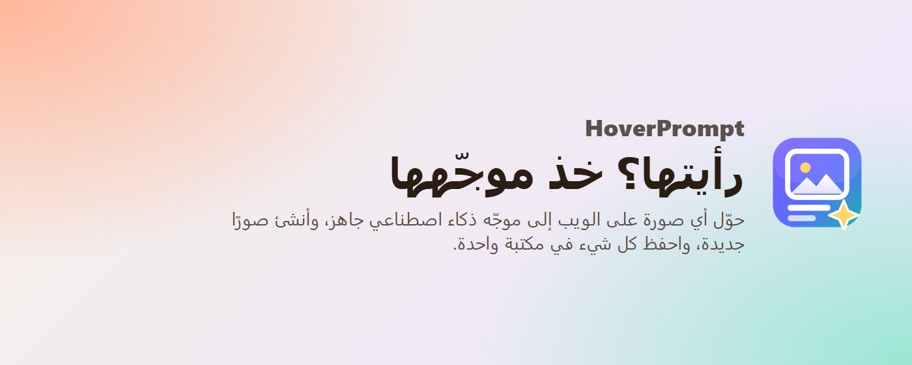
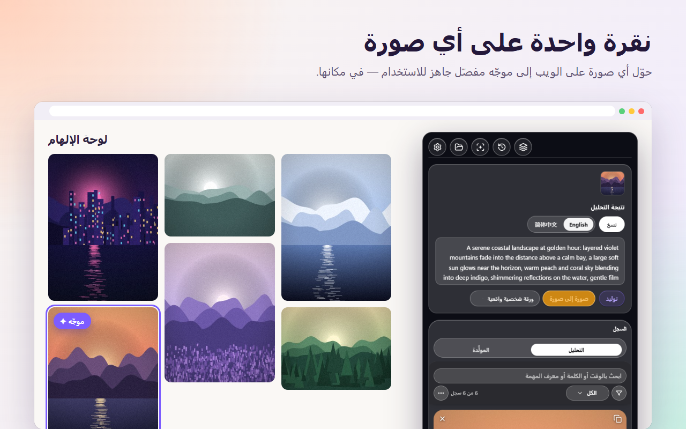
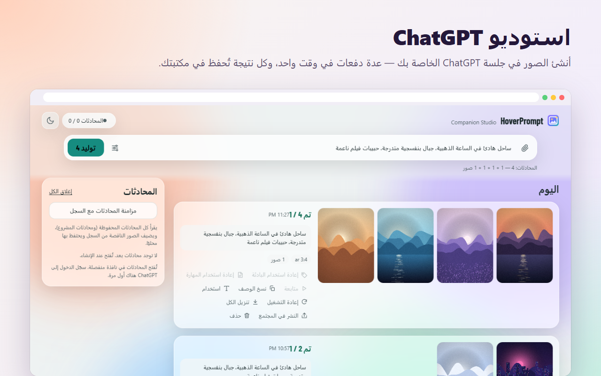
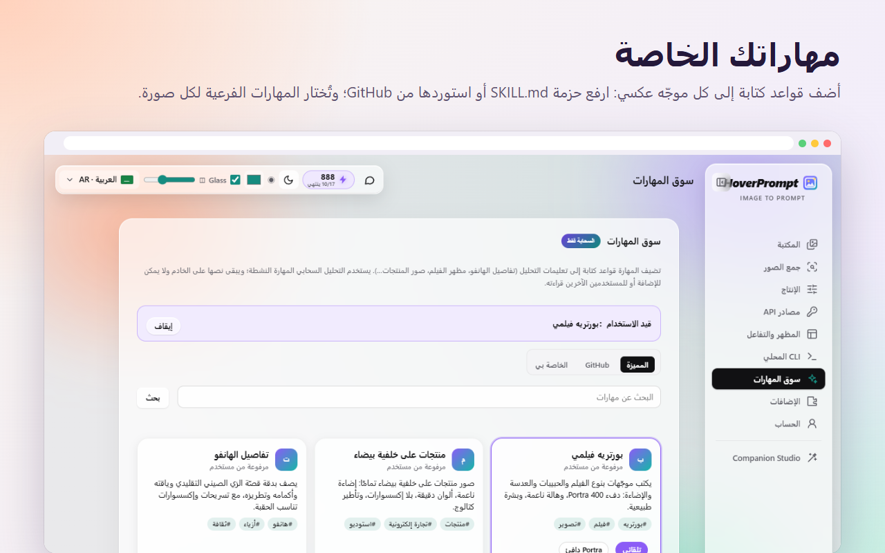
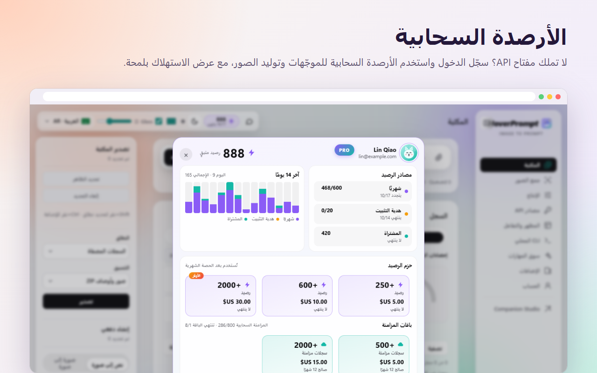
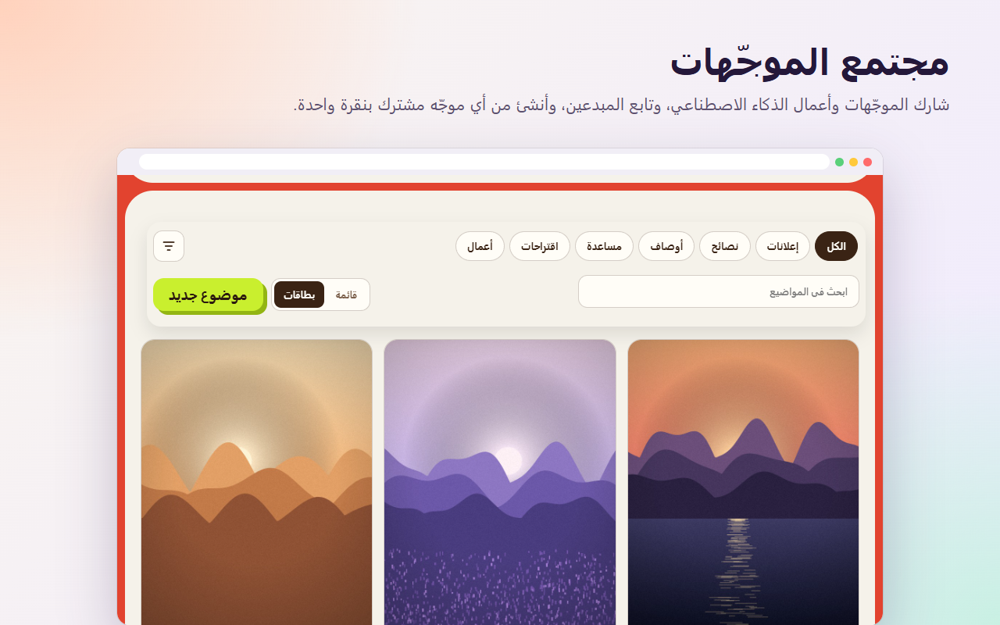
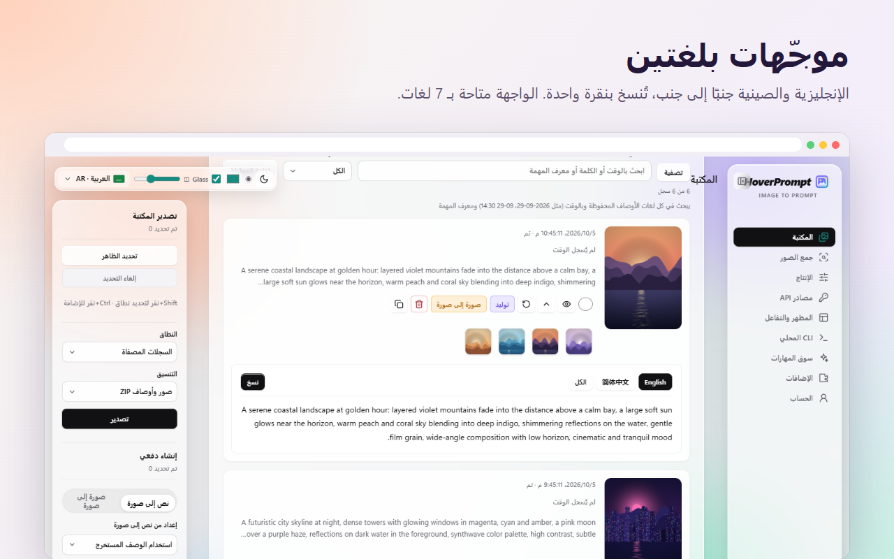
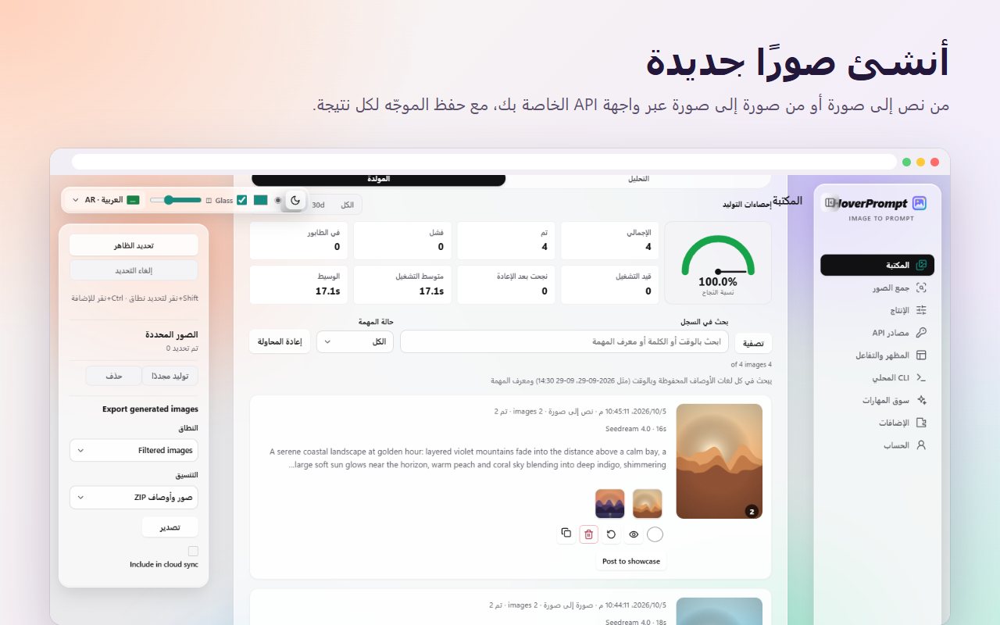
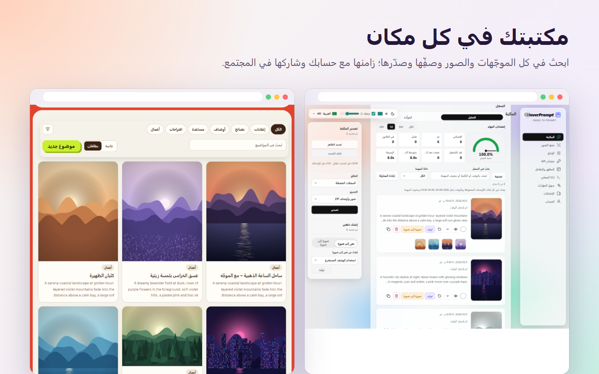

<div dir="rtl">

<p align="center"></p>

<h1 align="center">HoverPrompt</h1>

<p align="center">
  <b>إضافة موجّهات صور الذكاء الاصطناعي الشاملة.</b><br>
  اعكس أي صورة إلى موجّه · أنشئ بواجهة API الخاصة بك أو ChatGPT أو الأرصدة السحابية ·<br>
  مهارات مخصّصة · مكتبة قابلة للبحث · مجتمع الموجّهات · **CLI** (الاتصال برصيد الحساب والتحكم بالإضافة للتعرّف التلقائي على الصور وتوليد الموجّهات) — في إضافة Chrome / Edge واحدة.
</p>

<p align="center">
  <a href="https://hoverprompt.com/?lang=ar"><b>الموقع</b></a> ·
  <a href="https://hoverprompt.com/pricing?lang=ar">الأسعار</a> ·
  <a href="https://hoverprompt.com/community?lang=ar">المجتمع</a> ·
  <a href="https://hoverprompt.com/models?lang=ar">نماذج الذكاء الاصطناعي</a> ·
  <a href="README.md">English</a> ·
  <a href="README.zh-CN.md">简体中文</a> ·
  <a href="README.ja.md">日本語</a> ·
  <a href="README.ko.md">한국어</a> ·
  <a href="README.ru.md">Русский</a> ·
  <a href="README.hi.md">हिन्दी</a> ·
  <b>العربية</b>
</p>

<p align="center"><b>🆓 مجاني للاستخدام</b> — الإضافة نفسها مجانية؛ أدخل مفتاح API الخاص بك أو Ollama المحلي (بلا حساب).<br>
مدعوم: OpenAI Chat/Responses وAnthropic وGemini وOllama؛ التوليد: متوافق مع OpenAI وModelScope وGemini/Imagen وSeedream. المفاتيح مشفّرة (AES-256-GCM) في <code>chrome.storage.local</code> على جهازك فقط — بلا مزامنة أو رفع.<br>
سحابة اختيارية: المجاني <b>10</b>/شهر + هدية تثبيت <b>20</b>؛ Plus والباقات اختيارية.</p>


---

## كل شيء في إضافة واحدة

| | ما تحصل عليه |
|---|---|
| 🔍 **عكس الموجّهات** | مرّر المؤشر فوق أي صورة على أي موقع → موجّه مفصّل بالإنجليزية والصينية ولغات أخرى، لـ Midjourney وStable Diffusion وFlux وChatGPT… |
| 🎨 **ثلاث طرق للإنشاء** | واجهة API الخاصة بك (متوافقة مع OpenAI وGemini / Imagen وSeedream وModelScope)، **ChatGPT Studio** في جلسة ChatGPT الخاصة بك، أو **أرصدة سحابية** بلا مفتاح على الإطلاق |
| 🤖 **ChatGPT Studio** | إنشاء صور بالجملة عبر صفحة ChatGPT على الويب: عدة محادثات دفعة واحدة، ومراجع ونِسب أبعاد، وتُحفظ النتائج تلقائيًا |
| 🧩 **مهارات مخصّصة** | قواعد كتابتك لكل موجّه عكسي: ارفع حزمة `SKILL.md`، أو استورد من GitHub، ومهارات فرعية تُختار لكل صورة |
| ☁️ **أرصدة سحابية ومزامنة** | سجّل الدخول للعكس والإنشاء السحابي، والأرصدة بنظرة واحدة، ومزامنة المكتبة بين الأجهزة، وتجربة Plus مجانية لـ 7 أيام |
| 💬 **المجتمع** | شارك الموجّهات وأعمال الذكاء الاصطناعي، وتابع المبدعين، وأنشئ من أي موجّه مشترك بنقرة واحدة |
| 📚 **المكتبة** | كل موجّه وصورة، قابلة للبحث بأي لغة، مع نسب النجاح والأوقات؛ صدّر كـ ZIP |
| 🗂️ **جمع الصفحة والدُفعات** | اجمع مراجع الصفحة كاملة (مع تخطّي الإعلانات والأيقونات والمكررات)، واعكس ملاحظة Xiaohongshu كاملة، وصورة إلى صورة بالدفعة |
| ⌨️ **CLI والوكلاء** | **أبرزها:** الاتصال بـ**رصيد حساب** HoverPrompt، أو التحكم بالإضافة لـ**التعرّف التلقائي على الصور وتوليد الموجّهات**؛ مع قراءة المكتبة وتعليمات للوكيل |
| 🔒 **محلي أولًا** | يعمل دون حساب؛ مفاتيح API لا تغادر متصفحك |


> مبني لـ**المصمّمين** و**المبدعين** وفرق **المنتج** وصنّاع **الأفلام والفيديو بالذكاء الاصطناعي**.

## CLI — رصيد الحساب والتحكم بالإضافة

واجهة Node.js في [`extension/cli`](extension/cli) (`imageprompt.mjs`) جزء أساسي من HoverPrompt:

1. **رصيد الحساب** — `login` يفتح موافقة الجهاز على [hoverprompt.com](https://hoverprompt.com)؛ ثم `analyze` / `batch` يستهلكان **أرصدة السحابة**. `me` يعرض الحصة.
2. **التحكم بالإضافة** — ثبّت جسر Native Messaging (Windows / Chrome / Edge)، فعّل **الإعدادات → Local CLI**، واستخدم `local search` / `local scan` + `local submit` لجعل الإضافة **تتعرّف تلقائياً على صور الصفحة وتضع مهام عكس الموجّه في الطابور**.

```powershell
powershell -ExecutionPolicy Bypass -File cli/install-local-bridge.ps1 -ExtensionId YOUR_EXTENSION_ID
$cli = Join-Path $env:LOCALAPPDATA 'HoverPrompt\cli\imageprompt.mjs'

node $cli login
node $cli me
node $cli analyze photo.jpg --wait true

node $cli local doctor
node $cli local search --site pinterest.com --query "film portrait" --scope scroll
node $cli local submit --scan-id SCAN_ID --limit 20
node $cli local get TASK_ID
```

`local search` / `local scan` يجمعان عناوين الصور فقط (بدون استدعاء نموذج). `local submit` قد يستخدم واجهتك الشخصية أو **أرصدة السحابة** حسب وضع الإضافة. الرمز: `~/.hoverprompt/credentials.json` (أو `IMAGEPROMPT_TOKEN`). القائمة الكاملة: [docs/CLI-AGENT.md](docs/CLI-AGENT.md).

## أبرز الميزات

### نقرة واحدة على أي صورة

مرّر المؤشر فوق صورة، واضغط **الموجّه**، واحصل على موجّه جاهز للاستخدام حيث وجدتها — بلغتين، يُنسخ بنقرة واحدة.



### ChatGPT Studio

أنشئ صورًا من الإضافة بحسابك في **ChatGPT**. اكتب موجّهًا (أو الصق مراجع)، واختر النسبة وعدد الصور، فيشغّل HoverPrompt عدة محادثات ChatGPT بالتوازي، ويجلب كل صورة ويحفظها في مكتبتك مع موجّهها. أعد التشغيل أو أعد استخدام الموجّه أو انشر النتيجة في المجتمع بنقرة واحدة.



### مهارات مخصّصة

المهارة مجموعة قواعد كتابة تُضاف إلى الموجّه العكسي — مخزون الأفلام والحبيبات، لقطات منتجات على خلفية بيضاء، تفاصيل ملابس الهانفو، فلسفة تصميم… ارفع حزمة `SKILL.md` الخاصة بك (مع مهارات فرعية وشروط «متى تُستخدم»)، أو استورد من GitHub، أو اختر مهارة مقترحة. مع **تلقائي** تُختار المهارة الفرعية المناسبة لكل صورة.



### أرصدة سحابية

لا مفتاح API؟ سجّل الدخول في [hoverprompt.com](https://hoverprompt.com/?lang=ar) واستخدم **الأرصدة السحابية** للعكس وإنشاء الصور مع [النماذج المسمّاة](https://hoverprompt.com/models?lang=ar) (Qwen-Image وFLUX وZ-Image وSDXL…). تُظهر نافذة الأرصدة مصدر أرصدتك، واستخدام آخر 14 يومًا، وباقات لا تنتهي صلاحيتها. يمكن للحسابات الجديدة المطالبة بـ**تجربة Plus مجانية لـ 7 أيام** — دون بطاقة.



### المجتمع

انشر موجّهاتك وصورك في [مجتمع HoverPrompt](https://hoverprompt.com/community?lang=ar)، وتصفّح المعرض، وأعجب وأضف إلى المفضلة وتابع — واضغط **أنشئ بهذا الموجّه** للإنشاء من أي موجّه مشترك.



### والمزيد

| | |
|---|---|
|  |  |
|  | |

## التثبيت من المصدر

1. نزّل هذا المستودع أو انسخه (clone).
2. افتح `chrome://extensions` (Chrome) أو `edge://extensions` (Edge) وفعّل **وضع المطوّر**.
3. انقر **تحميل غير مُعبّأ** واختر مجلد [`extension`](extension).
4. ثبّت HoverPrompt، وافتح أي صفحة ويب ومرّر المؤشر فوق صورة.

يتطلّب Chrome أو Edge 111 أو أحدث. بلا خطوة بناء: الإضافة JavaScript عادي (Manifest V3).

**ChatGPT Studio:** فعّله في **الإعدادات → الإضافات**، ثم افتح **Companion Studio** من الشريط الجانبي. في المرّة الأولى سجّل الدخول إلى ChatGPT في النافذة التي تفتح.

## تسجيل الدخول (اختياري)

افتح إعدادات الإضافة → **الحساب والمزامنة** → **تسجيل الدخول**. تُفتح صفحة على hoverprompt.com؛ وافق على الجهاز هناك (رمز البريد أو GitHub). تتلقّى الإضافة رمز وصول لحسابك فقط — لا تُخزَّن كلمة المرور في الإضافة. يمكنك تسجيل الخروج من الصفحة نفسها في أي وقت.

مع حساب: عكس وإنشاء سحابي بالأرصدة، وسوق المهارات، ومزامنة المكتبة بين الأجهزة، والنشر في المجتمع، وتجربة Plus مجانية لـ 7 أيام. انظر [الأسعار](https://hoverprompt.com/pricing?lang=ar).

## مفاتيح API الخاصة بك

في الوضع المحلي تستخدم نماذجك وواجهات صور API الخاصة بك (الإعدادات → **مصادر API** و**الإنشاء**).

- **لا يحتوي هذا المستودع على مفاتيح API أو رموز أو أسرار.** لا تُدرج مفاتيحك في الالتزامات.
- تُخزَّن المفاتيح التي تدخلها مشفّرة (AES-256-GCM) فقط في تخزين الإضافة بالمتصفح (`chrome.storage.local`) وتُرسل فقط إلى نقطة نهاية API التي ضبطتها. لا تُرفع إلى HoverPrompt.
- النماذج المحلية (مثل Ollama على `localhost`) تعمل أيضًا ودون تكلفة.


## تخطيط المشروع

<div dir="ltr">

```
extension/            the browser extension (Manifest V3), load this folder unpacked
  manifest.json
  background.js       service worker: context menu, tasks, cloud and CLI messages
  content.js          on-page buttons and the floating panel
  app.js, api.js      reverse prompts with local / your own / cloud models
  imagegen*.js        image generation with your own APIs
  chatgpt-*.js        ChatGPT Studio (runs in your own ChatGPT session)
  skills-ui.js        skill market and your own skills
  cloud.js            optional HoverPrompt account: sign-in, sync, credits
  credits-panel.js    the cloud credits window
  community-share.js  posting to the community
  cli/                local CLI and Native Messaging bridge
  _locales/           store name and description (English, Simplified Chinese)
docs/                 screenshots and the CLI / agent guide
```

</div>

## الخصوصية

يبقي الوضع المحلي كل شيء في متصفحك. عند تسجيل الدخول يُرسل إلى HoverPrompt فقط ما تختار مزامنته. اقرأ كامل [سياسة الخصوصية](https://hoverprompt.com/privacy?lang=ar) و[شروط الخدمة](https://hoverprompt.com/terms?lang=ar) و[سياسة الاستخدام المقبول](https://hoverprompt.com/acceptable-use?lang=ar).

يشغّل ChatGPT Studio صفحة ChatGPT على الويب في متصفحك بحسابك؛ HoverPrompt غير مرتبط بـ OpenAI. استخدمه وفق شروط الخدمات التي تصلها.

## المساهمة

مرحبًا بالمشكلات وطلبات السحب. أبقِ التغييرات صغيرة ومركّزة، واختبرها بتحميل الإضافة غير المعبّأة، ولا تُدرج أبدًا مفاتيح API أو بيانات شخصية في الالتزامات.

## الترخيص

[HoverPrompt Source-Available License 1.0](LICENSE) © 2026 HoverPrompt: الاستخدام كأداة مجاني، بما في ذلك العمل المدفوع. بناء منتج أو خدمة تجارية من الشيفرة، أو إعادة توزيع نسخ معدّلة أو مدفوعة، يتطلب إذنًا كتابيًا (support@hoverprompt.com). الإصدارات حتى v3.10.9 صدرت بترخيص MIT. الخطوط بموجب SIL Open Font License ([extension/fonts/OFL.txt](extension/fonts/OFL.txt))؛ الأيقونات من [Lucide](https://lucide.dev) ([extension/icons/LUCIDE-LICENSE.txt](extension/icons/LUCIDE-LICENSE.txt)).

اسم HoverPrompt وشعاره يعرّفان الإضافة والموقع الرسميين؛ يُرجى استخدام اسم وشعار مختلفين لإصداراتك الخاصة.

</div>
