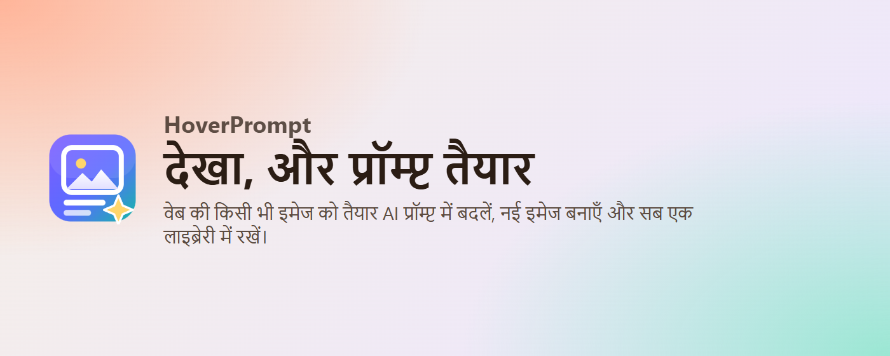
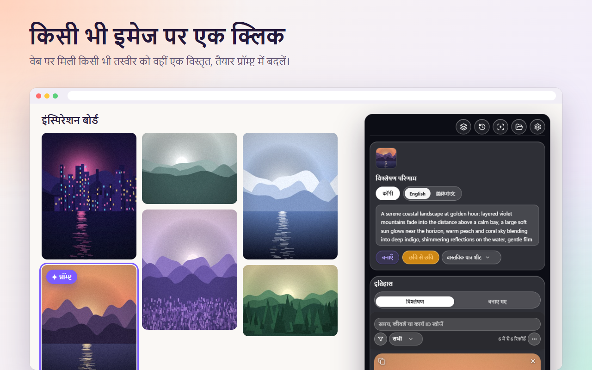
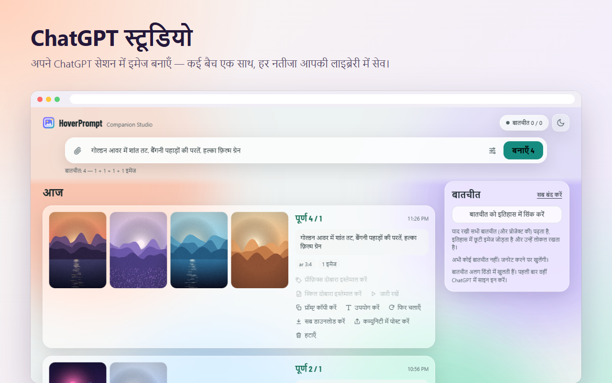
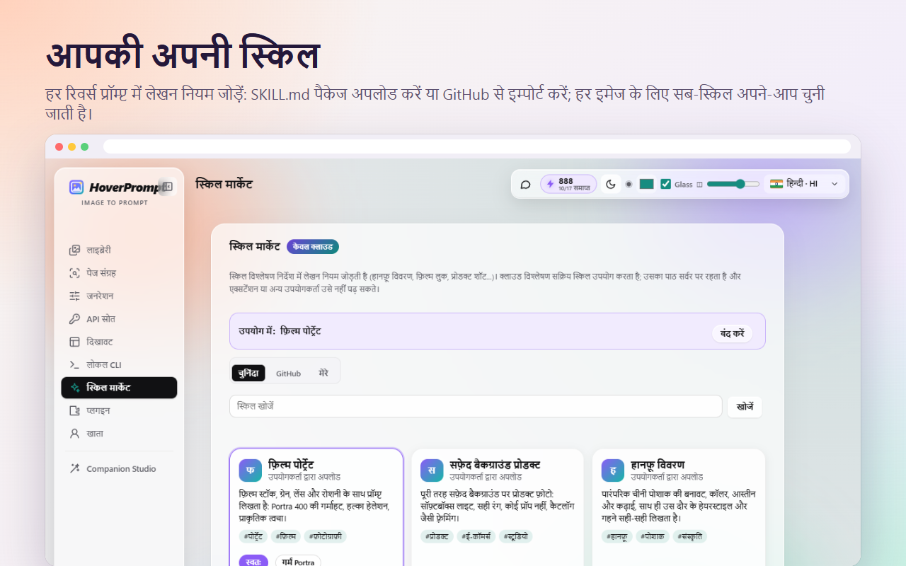
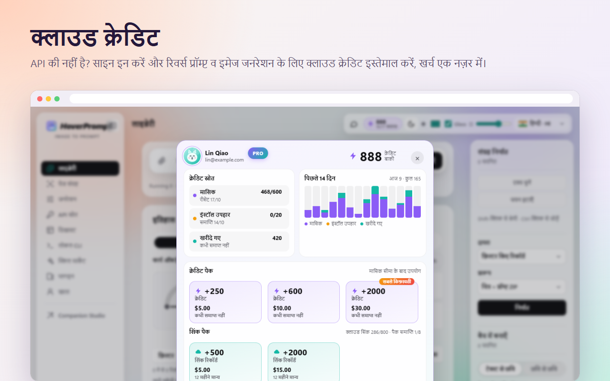
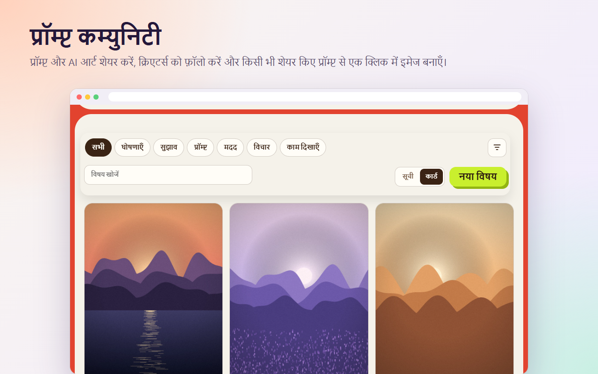
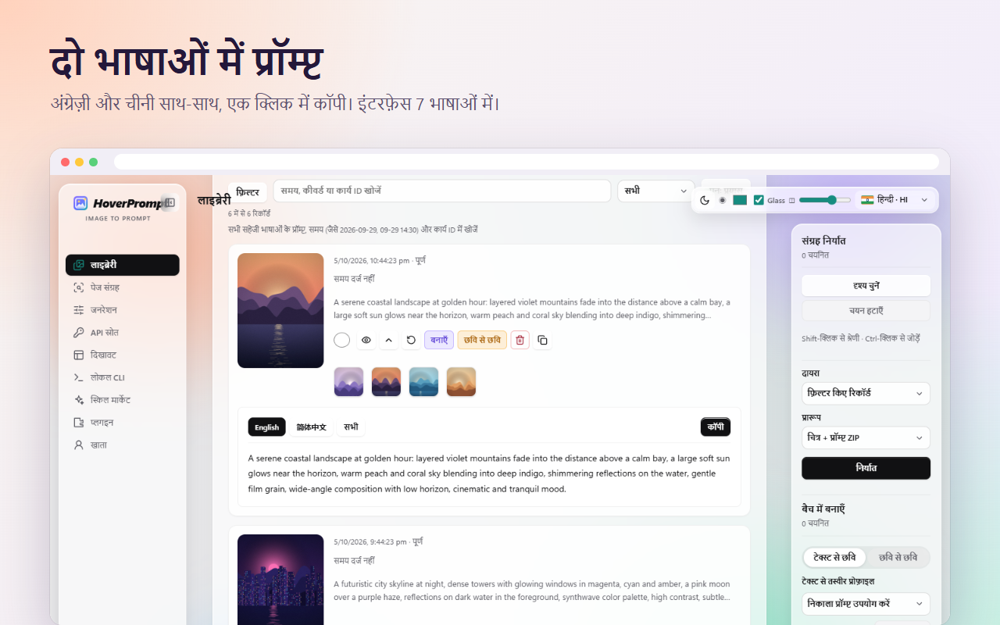
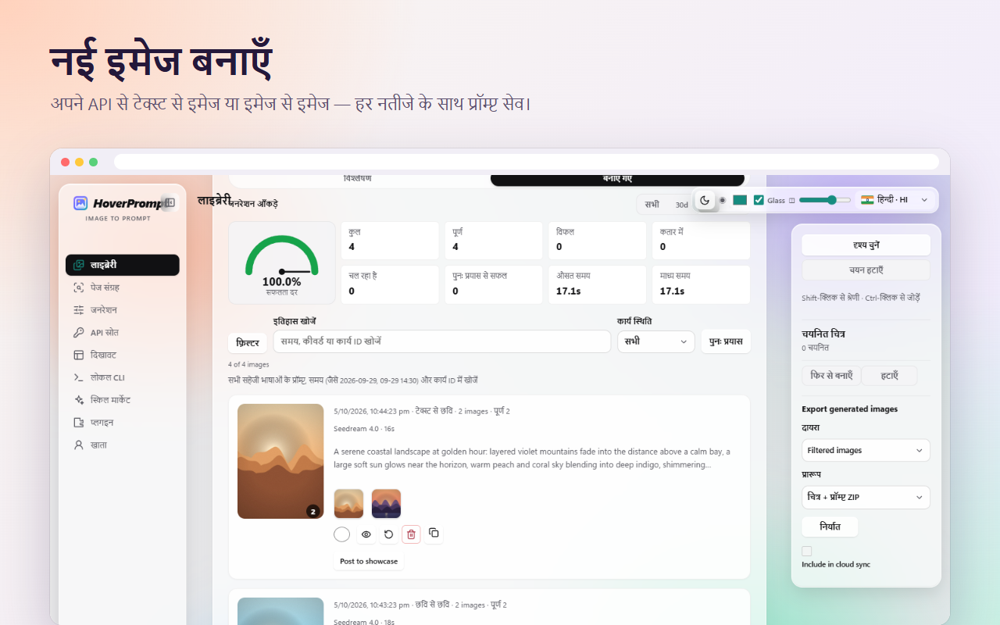
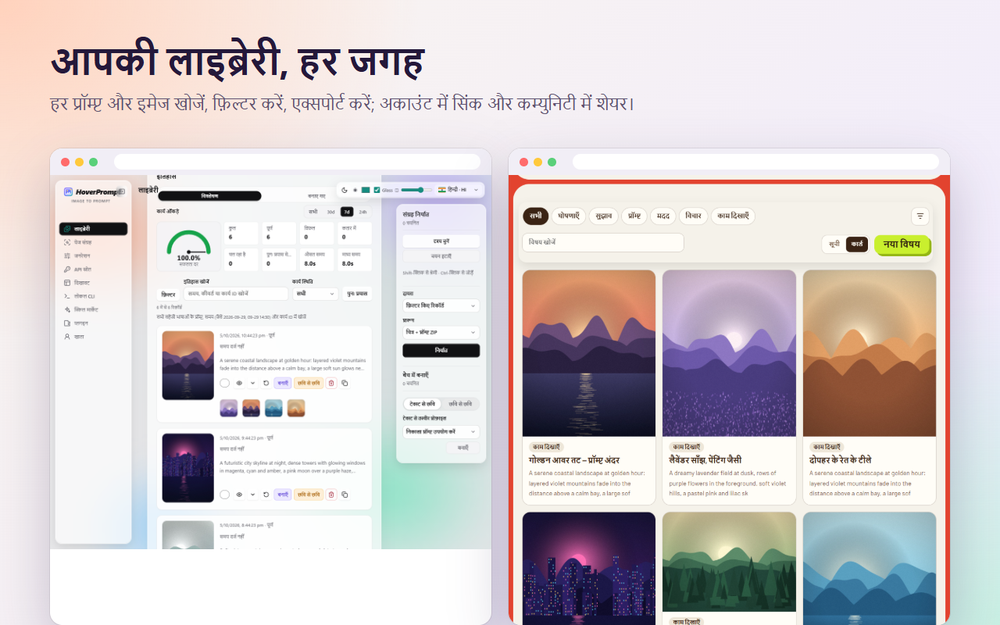

<p align="center"></p>

<h1 align="center">HoverPrompt</h1>

<p align="center">
  <b>ऑल-इन-वन AI इमेज प्रॉम्प्ट एक्सटेंशन.</b><br>
  किसी भी इमेज को प्रॉम्प्ट में रिवर्स करें · अपने API, ChatGPT या क्लाउड क्रेडिट से जनरेट करें ·<br>
  कस्टम स्किल · खोजने योग्य लाइब्रेरी · प्रॉम्प्ट कम्युनिटी · **CLI** (अकाउंट कोटा से जुड़ें और एक्सटेंशन नियंत्रित कर इमेज स्वतः पहचान/प्रॉम्प्ट बनाएँ) — एक ही Chrome / Edge एक्सटेंशन में.
</p>

<p align="center">
  <a href="https://hoverprompt.com/?lang=hi"><b>वेबसाइट</b></a> ·
  <a href="https://hoverprompt.com/pricing?lang=hi">कीमतें</a> ·
  <a href="https://hoverprompt.com/community?lang=hi">कम्युनिटी</a> ·
  <a href="https://hoverprompt.com/models?lang=hi">AI मॉडल</a> ·
  <a href="README.md">English</a> ·
  <a href="README.zh-CN.md">简体中文</a> ·
  <a href="README.ja.md">日本語</a> ·
  <a href="README.ko.md">한국어</a> ·
  <a href="README.ru.md">Русский</a> ·
  <b>हिन्दी</b> ·
  <a href="README.ar.md">العربية</a>
</p>

<p align="center"><b>🆓 मुफ़्त उपयोग</b> — एक्सटेंशन मुफ़्त; अपनी API कुंजी या लोकल Ollama दर्ज करें (खाता ज़रूरी नहीं)।<br>
समर्थित: OpenAI Chat/Responses, Anthropic, Gemini, Ollama; इमेज जन: OpenAI-संगत, ModelScope, Gemini/Imagen, Seedream. कुंजियाँ AES-256-GCM से एन्क्रिप्ट होकर केवल इस डिवाइस के ब्राउज़र <code>chrome.storage.local</code> में — सिंक/अपलोड नहीं。<br>
वैकल्पिक क्लाउड: Free पर महीने <b>40</b> + इंस्टॉल उपहार <b>20</b> क्रेडिट; Plus/पैक वैकल्पिक।</p>


---

## एक एक्सटेंशन में सब कुछ

| | आपको क्या मिलता है |
|---|---|
| 🔍 **प्रॉम्प्ट रिवर्स** | किसी भी साइट की किसी भी इमेज पर होवर करें → Midjourney, Stable Diffusion, Flux, ChatGPT… के लिए अंग्रेज़ी, चीनी और अन्य भाषाओं में विस्तृत प्रॉम्प्ट |
| 🎨 **जनरेट करने के तीन तरीके** | आपका अपना API (OpenAI-संगत, Gemini / Imagen, Seedream, ModelScope), आपके ChatGPT सेशन में **ChatGPT Studio**, या बिना की के **क्लाउड क्रेडिट** |
| 🤖 **ChatGPT Studio** | ChatGPT वेब पेज से बैच इमेज जनरेशन: एक साथ कई बातचीत, रेफ़रेंस, रेशियो, नतीजे अपने-आप सेव |
| 🧩 **कस्टम स्किल** | हर रिवर्स प्रॉम्प्ट के लिए अपने लेखन नियम: `SKILL.md` पैकेज अपलोड करें, GitHub से इम्पोर्ट करें, हर इमेज के लिए चुने जाने वाले सब-स्किल |
| ☁️ **क्लाउड क्रेडिट और सिंक** | साइन इन पर क्लाउड रिवर्स और इमेज जनरेशन, क्रेडिट एक नज़र में, डिवाइसों पर लाइब्रेरी सिंक, मुफ़्त 7-दिन Plus ट्रायल |
| 💬 **कम्युनिटी** | प्रॉम्प्ट और AI आर्ट शेयर करें, क्रिएटर्स को फ़ॉलो करें, किसी भी शेयर किए गए प्रॉम्प्ट से एक क्लिक में जनरेट करें |
| 📚 **लाइब्रेरी** | हर प्रॉम्प्ट और इमेज, हर भाषा में खोजने योग्य, सफलता दर और समय के साथ; ZIP में एक्सपोर्ट |
| 🗂️ **पेज कलेक्शन और बैच** | पूरे पेज के रेफ़रेंस इकट्ठा करें (विज्ञापन, आइकन और डुप्लिकेट छोड़ दिए जाते हैं), पूरी Xiaohongshu नोट रिवर्स करें, बैच इमेज-से-इमेज |
| ⌨️ **CLI और एजेंट** | **मुख्य:** HoverPrompt **अकाउंट क्रेडिट** से जुड़ें, या एक्सटेंशन नियंत्रित कर **इमेज स्वतः पहचानें और प्रॉम्प्ट बनाएँ**; लाइब्रेरी पढ़ना और एजेंट निर्देश भी |
| 🔒 **लोकल-फ़र्स्ट** | बिना अकाउंट के काम करता है; आपकी API की ब्राउज़र से बाहर नहीं जाती |


> **डिज़ाइनर**, **क्रिएटिव**, **प्रोडक्ट** टीम और **AI फ़िल्म व वीडियो** निर्माताओं के लिए बनाया गया.

## CLI — अकाउंट क्रेडिट और एक्सटेंशन नियंत्रण

[`extension/cli`](extension/cli) में Node.js CLI (`imageprompt.mjs`) HoverPrompt की मुख्य क्षमता है:

1. **अकाउंट कोटा** — `login` [hoverprompt.com](https://hoverprompt.com) पर डिवाइस अनुमोदन खोलता है; फिर `analyze` / `batch` आपके **क्लाउड क्रेडिट** इस्तेमाल करते हैं। `me` से कोटा देखें।
2. **एक्सटेंशन नियंत्रण** — Native Messaging ब्रिज लगाएँ (Windows / Chrome / Edge), **Settings → Local CLI** चालू करें, और `local search` / `local scan` + `local submit` से एक्सटेंशन **पेज की इमेज स्वतः पहचानकर रिवर्स-प्रॉम्प्ट कतार में डाले**.

```powershell
powershell -ExecutionPolicy Bypass -File cli/install-local-bridge.ps1 -ExtensionId YOUR_EXTENSION_ID
$cli = Join-Path $env:LOCALAPPDATA 'HoverPrompt\cli\imageprompt.mjs'

node $cli login
node $cli me
node $cli analyze photo.jpg --wait true

node $cli local doctor
node $cli local search --site pinterest.com --query "film portrait" --scope scroll
node $cli local submit --scan-id SCAN_ID --limit 20
node $cli local get TASK_ID
```

`local search` / `local scan` सिर्फ इमेज URL इकट्ठा करते हैं (मॉडल कॉल नहीं)। `local submit` एक्सटेंशन की सेटिंग के हिसाब से पर्सनल API या **क्लाउड क्रेडिट** ले सकता है। टोकन: `~/.hoverprompt/credentials.json` (या `IMAGEPROMPT_TOKEN`)। पूरी सूची: [docs/CLI-AGENT.md](docs/CLI-AGENT.md)।

## हाइलाइट्स

### किसी भी इमेज पर एक क्लिक

किसी तस्वीर पर होवर करें, **प्रॉम्प्ट** दबाएँ, और जहाँ मिली वहीं इस्तेमाल के लिए तैयार प्रॉम्प्ट पाएँ — दो भाषाओं में, एक क्लिक में कॉपी.



### ChatGPT Studio

एक्सटेंशन से ही **अपने ChatGPT अकाउंट** से इमेज जनरेट करें. प्रॉम्प्ट लिखें (या रेफ़रेंस पेस्ट करें), रेशियो और कितनी इमेज चुनें, और HoverPrompt कई ChatGPT बातचीत समानांतर चलाता है, हर इमेज लाता है और प्रॉम्प्ट के साथ लाइब्रेरी में सेव करता है. फिर से चलाएँ, प्रॉम्प्ट दोबारा इस्तेमाल करें या कम्युनिटी पर पोस्ट करें — एक क्लिक में.



### कस्टम स्किल

स्किल रिवर्स प्रॉम्प्ट में जोड़े गए लेखन नियमों का सेट है — फ़िल्म स्टॉक और ग्रेन, सफ़ेद बैकग्राउंड पर प्रोडक्ट शॉट, हानफ़ू कपड़ों की डिटेल, डिज़ाइन फ़िलॉसफ़ी… अपना `SKILL.md` पैकेज अपलोड करें (सब-स्किल और उनके «कब इस्तेमाल करें» शर्तों के साथ), GitHub से इम्पोर्ट करें, या सुझाई गई चुनें. **ऑटो** के साथ हर इमेज के लिए सही सब-स्किल चुनी जाती है.



### क्लाउड क्रेडिट

API की नहीं है? [hoverprompt.com](https://hoverprompt.com/?lang=hi) पर साइन इन करें और [नामित मॉडल](https://hoverprompt.com/models?lang=hi) (Qwen-Image, FLUX, Z-Image, SDXL…) से रिवर्स और इमेज जनरेशन के लिए **क्लाउड क्रेडिट** इस्तेमाल करें. क्रेडिट विंडो दिखाती है क्रेडिट कहाँ से आए, पिछले 14 दिनों का उपयोग, और कभी समाप्त न होने वाले पैक. नए अकाउंट **मुफ़्त 7-दिन Plus ट्रायल** ले सकते हैं — कार्ड की ज़रूरत नहीं.



### कम्युनिटी

अपने प्रॉम्प्ट और इमेज [HoverPrompt कम्युनिटी](https://hoverprompt.com/community?lang=hi) पर पोस्ट करें, शोकेस देखें, लाइक, फ़ेवरिट और फ़ॉलो करें — और **इस प्रॉम्प्ट से जनरेट करें** दबाकर किसी भी शेयर किए गए प्रॉम्प्ट से जनरेट करें.



### और भी

| | |
|---|---|
|  |  |
|  | |

## सोर्स से इंस्टॉल

1. इस रिपॉज़िटरी को डाउनलोड या क्लोन करें.
2. `chrome://extensions` (Chrome) या `edge://extensions` (Edge) खोलें और **डेवलपर मोड** चालू करें.
3. **अनपैक्ड लोड करें** पर क्लिक करें और [`extension`](extension) फ़ोल्डर चुनें.
4. HoverPrompt पिन करें, कोई भी वेब पेज खोलें और किसी इमेज पर होवर करें.

Chrome या Edge 111 या बाद का चाहिए. कोई बिल्ड स्टेप नहीं: एक्सटेंशन सादा JavaScript है (Manifest V3).

**ChatGPT Studio:** **सेटिंग्स → प्लगइन्स** में चालू करें, फिर साइडबार से **Companion Studio** खोलें. पहली बार खुली विंडो में ChatGPT में साइन इन करें.

## लाइब्रेरी खोए बिना अपडेट

3.10.13 से GitHub वाले एक्सटेंशन का एक स्थायी एक्सटेंशन ID (`eimnpachdlgijdddmogpopdmemcckodm`) है — चाहे किसी भी फ़ोल्डर से लोड करें। लाइब्रेरी, सेटिंग्स और API कीज़ इसी ID के साथ रहती हैं।

- **सामान्य अपडेट:** नया वर्ज़न मौजूदा एक्सटेंशन फ़ोल्डर पर ही अनज़िप करें (फ़ाइलें बदलें), फिर `chrome://extensions` (या `edge://extensions`) में HoverPrompt पर **Reload** दबाएँ।
- **दूसरा फ़ोल्डर भी चलेगा:** कहीं भी अनज़िप करके **Load unpacked** से लोड करें — यह वही एक्सटेंशन है, डेटा बना रहता है।
- **“Remove” कभी न दबाएँ** — इससे लाइब्रेरी और सेटिंग्स मिट जाती हैं। बड़े बदलाव से पहले Settings → Interface → **Backup and move** से पूरा बैकअप निकाल लें।

**3.10.12 या पुराने से माइग्रेशन (सिर्फ़ एक बार):** पुराने वर्ज़न का ID फ़ोल्डर पाथ से बनता था, इसलिए स्थायी ID वाला वर्ज़न खाली शुरू होता है। एक बार डेटा ले जाएँ:
1. `hoverprompt-extension-3.10.13-migrate.zip` (पुराना ID रखने वाला माइग्रेशन बिल्ड) को **पुराने** फ़ोल्डर पर अनज़िप करें और **Reload** दबाएँ। Settings → Interface → **Backup and move** में पूरा बैकअप एक्सपोर्ट करें (API कीज़ भी ले जानी हों तो “Include API keys” चुनें)।
2. `hoverprompt-extension-3.10.13.zip` को **नए** फ़ोल्डर में अनज़िप करके लोड करें और उसी जगह बैकअप इम्पोर्ट करें।
3. लाइब्रेरी और सेटिंग्स दिखने के बाद ही पुराना एक्सटेंशन हटाएँ। सामान्य बिल्ड को पुराने फ़ोल्डर पर न डालें — पुराना डेटा पढ़ा नहीं जा सकेगा।

## साइन इन (वैकल्पिक)

एक्सटेंशन सेटिंग्स → **अकाउंट और सिंक** → **साइन इन** खोलें. hoverprompt.com पर एक पेज खुलता है; वहाँ डिवाइस को मंज़ूरी दें (ईमेल कोड या GitHub). एक्सटेंशन को सिर्फ़ आपके अकाउंट का एक्सेस टोकन मिलता है — पासवर्ड एक्सटेंशन में सेव नहीं होता. उसी पेज से कभी भी साइन आउट करें.

अकाउंट के साथ: क्रेडिट से क्लाउड रिवर्स और जनरेशन, स्किल मार्केट, डिवाइसों पर लाइब्रेरी सिंक, कम्युनिटी पर पोस्टिंग, और मुफ़्त 7-दिन Plus ट्रायल. देखें [कीमतें](https://hoverprompt.com/pricing?lang=hi).

## अपनी API की

लोकल मोड में आप अपने मॉडल और इमेज API लाते हैं (सेटिंग्स → **API सोर्स** और **जनरेशन**).

- **इस रिपॉज़िटरी में कोई API की, टोकन या सीक्रेट नहीं है.** अपनी कभी कमिट न करें.
- आपके दर्ज की गई कुंजियाँ AES-256-GCM से एन्क्रिप्ट होकर सिर्फ़ ब्राउज़र के एक्सटेंशन स्टोरेज (`chrome.storage.local`) में रहती हैं और सिर्फ़ आपके कॉन्फ़िगर किए गए API एंडपॉइंट पर भेजी जाती हैं. वे HoverPrompt पर अपलोड नहीं होतीं.
- लोकल मॉडल (जैसे `localhost` पर Ollama) भी काम करते हैं और मुफ़्त हैं.


## प्रोजेक्ट लेआउट

```
extension/            the browser extension (Manifest V3), load this folder unpacked
  manifest.json
  background.js       service worker: context menu, tasks, cloud and CLI messages
  content.js          on-page buttons and the floating panel
  app.js, api.js      reverse prompts with local / your own / cloud models
  imagegen*.js        image generation with your own APIs
  chatgpt-*.js        ChatGPT Studio (runs in your own ChatGPT session)
  skills-ui.js        skill market and your own skills
  cloud.js            optional HoverPrompt account: sign-in, sync, credits
  credits-panel.js    the cloud credits window
  community-share.js  posting to the community
  cli/                local CLI and Native Messaging bridge
  _locales/           store name and description (English, Simplified Chinese)
docs/                 screenshots and the CLI / agent guide
```

## प्राइवेसी

लोकल मोड सब कुछ आपके ब्राउज़र में रखता है. साइन इन के बाद सिर्फ़ वही HoverPrompt पर जाता है जो आप सिंक करना चुनते हैं. पूरा पढ़ें [गोपनीयता नीति](https://hoverprompt.com/privacy?lang=hi), [सेवा की शर्तें](https://hoverprompt.com/terms?lang=hi) और [स्वीकार्य उपयोग नीति](https://hoverprompt.com/acceptable-use?lang=hi).

ChatGPT Studio आपके ब्राउज़र में आपके अकाउंट से ChatGPT वेब पेज चलाता है; HoverPrompt OpenAI से जुड़ा नहीं है. जिन सेवाओं को जोड़ते हैं उनके नियमों के अनुसार इस्तेमाल करें.

## योगदान

Issues और pull requests का स्वागत है. बदलाव छोटे और केंद्रित रखें, अनपैक्ड एक्सटेंशन लोड करके टेस्ट करें, और कमिट में API की या निजी डेटा कभी शामिल न करें.

## लाइसेंस

[HoverPrompt Source-Available License 1.0](LICENSE) © 2026 HoverPrompt: टूल के रूप में उपयोग मुफ़्त है, भुगतान वाले काम सहित। कोड से व्यावसायिक उत्पाद या सेवा बनाने, या बदली हुई/सशुल्क प्रतियाँ वितरित करने के लिए लिखित अनुमति चाहिए (support@hoverprompt.com)। v3.10.9 तक के संस्करण MIT लाइसेंस के तहत जारी हुए थे। फ़ॉन्ट SIL Open Font License के अंतर्गत ([extension/fonts/OFL.txt](extension/fonts/OFL.txt)); आइकन [Lucide](https://lucide.dev) से ([extension/icons/LUCIDE-LICENSE.txt](extension/icons/LUCIDE-LICENSE.txt)).

HoverPrompt नाम और लोगो आधिकारिक एक्सटेंशन और वेबसाइट को पहचानते हैं; अपने बिल्ड के लिए अलग नाम और लोगो इस्तेमाल करें.
