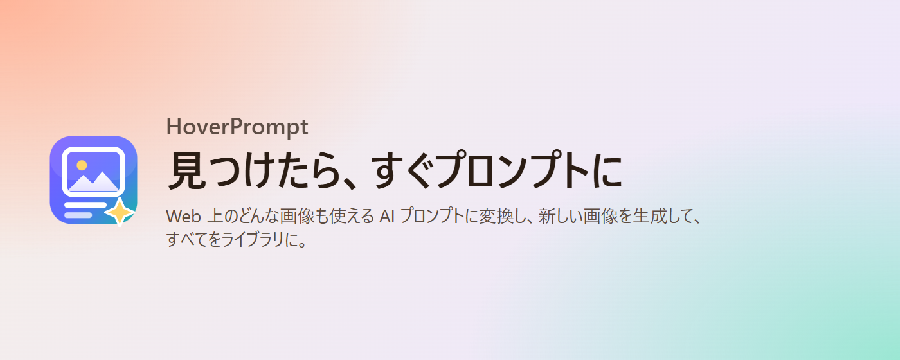
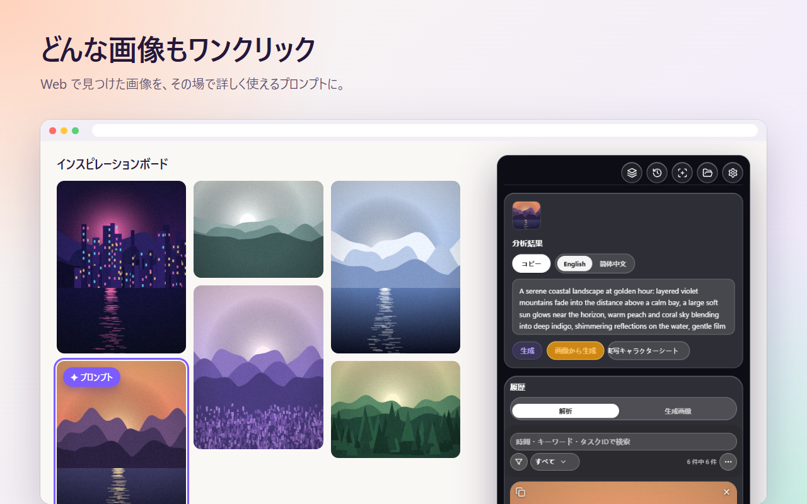
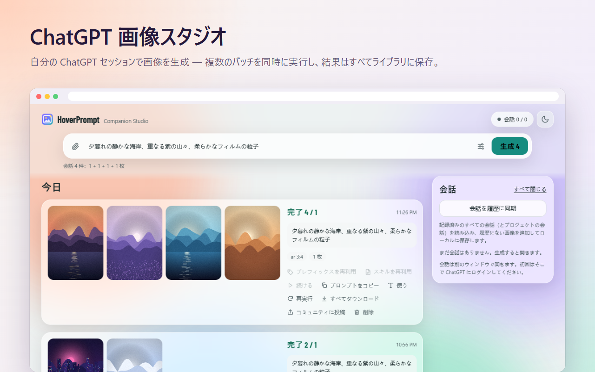
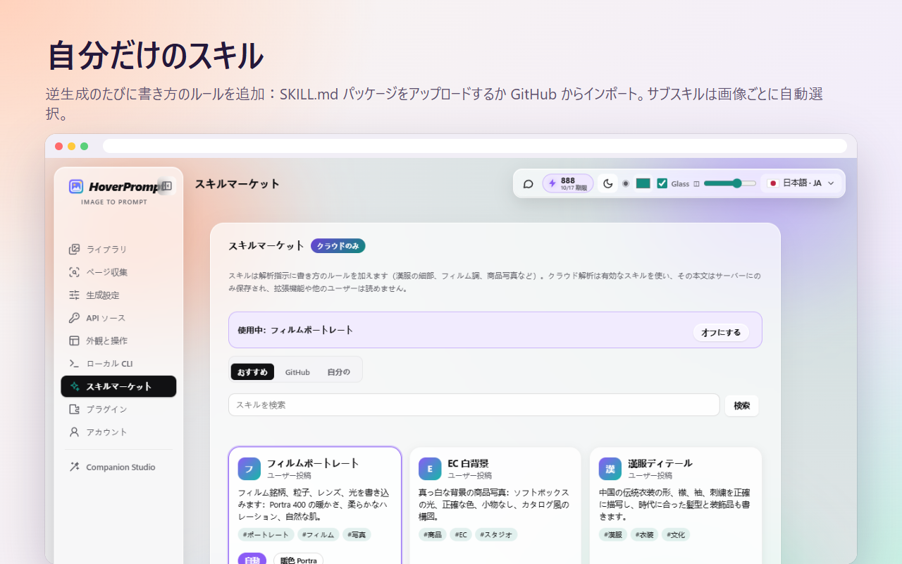
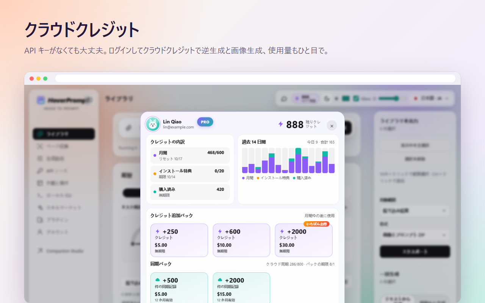
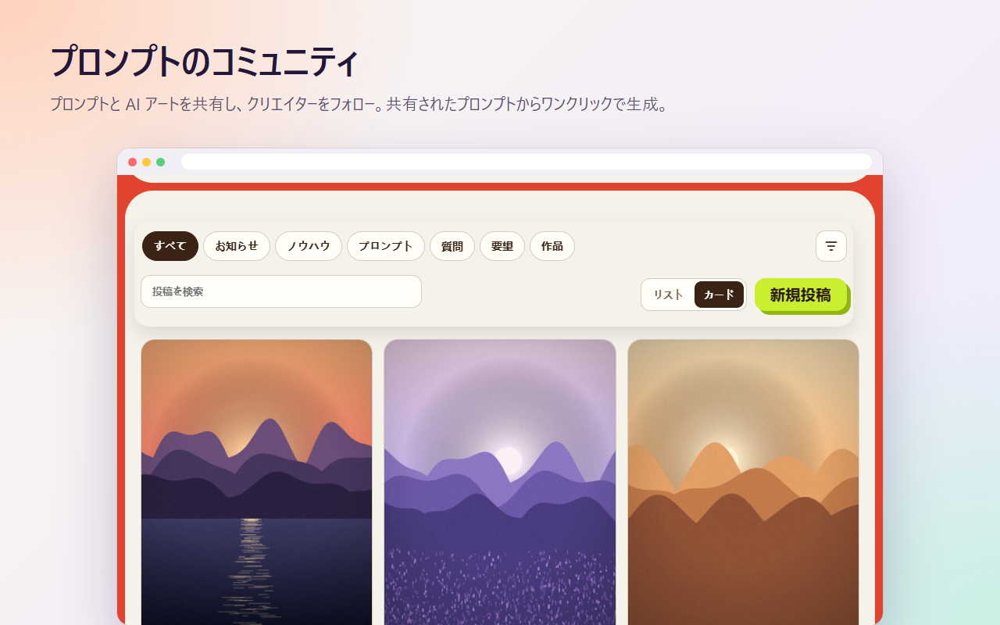
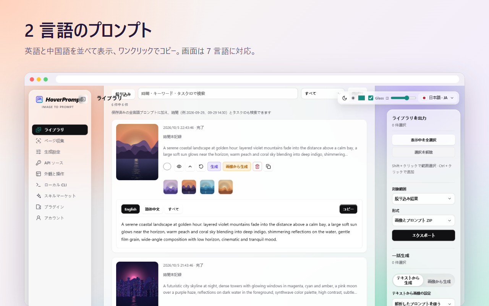
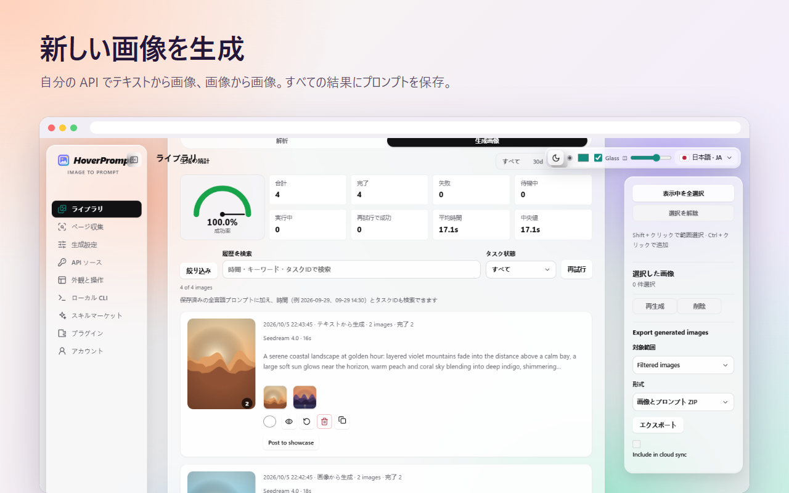
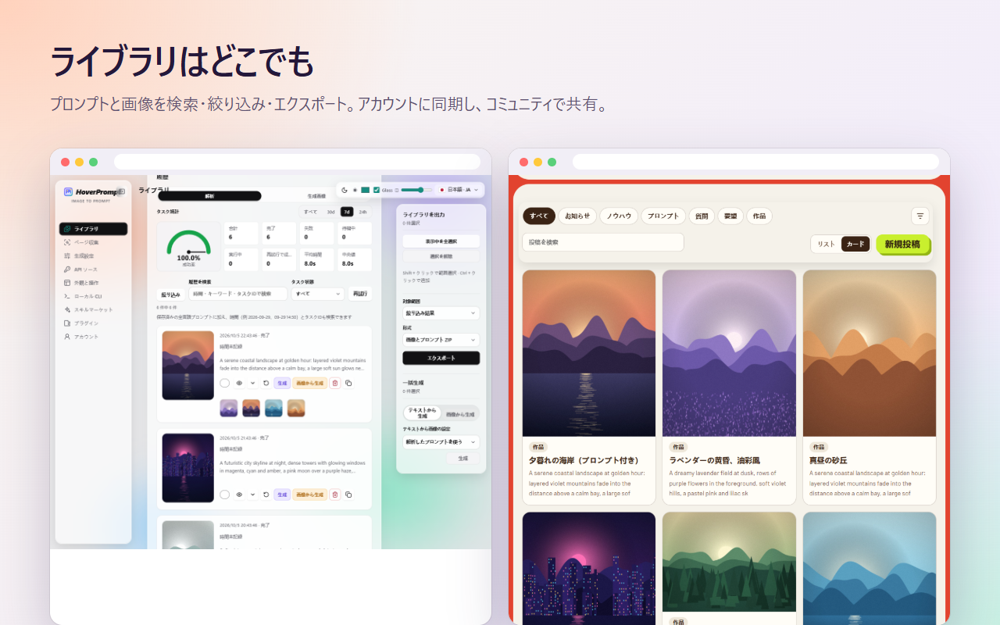

<p align="center"></p>

<h1 align="center">HoverPrompt</h1>

<p align="center">
  <b>オールインワンの AI 画像プロンプト拡張機能。</b><br>
  どんな画像もプロンプトに反転 · 自分の API、ChatGPT、クラウドクレジットで生成 ·<br>
  カスタムスキル · 検索できるライブラリ · プロンプトコミュニティ · **CLI**（アカウント枠に接続し、拡張を制御して画像を自動認識・プロンプト生成）— すべて 1 つの Chrome / Edge 拡張に。
</p>

<p align="center">
  <a href="https://hoverprompt.com/?lang=ja"><b>公式サイト</b></a> ·
  <a href="https://hoverprompt.com/pricing?lang=ja">料金</a> ·
  <a href="https://hoverprompt.com/community?lang=ja">コミュニティ</a> ·
  <a href="https://hoverprompt.com/models?lang=ja">AI モデル</a> ·
  <a href="README.md">English</a> ·
  <a href="README.zh-CN.md">简体中文</a> ·
  <b>日本語</b> ·
  <a href="README.ko.md">한국어</a> ·
  <a href="README.ru.md">Русский</a> ·
  <a href="README.hi.md">हिन्दी</a> ·
  <a href="README.ar.md">العربية</a>
</p>

<p align="center"><b>🆓 無料で使える</b> — 拡張本体は無料。自分の API キーまたは本機 Ollama を設定するだけ（アカウント不要）。<br>
対応: OpenAI Chat/Responses、Anthropic、Gemini、Ollama；画像生成は OpenAI 互換、ModelScope、Gemini/Imagen、Seedream。キーは AES-256-GCM で暗号化して端末のブラウザ <code>chrome.storage.local</code> のみに保存（同期・アップロードなし）。<br>
任意のクラウド：無料プランは月 <b>10</b> 回 + インストール特典 <b>20</b> クレジット。Plus / パックは任意。</p>


---

## すべてが 1 つの拡張に

| | できること |
|---|---|
| 🔍 **プロンプト反転** | どのサイトの画像にもカーソルを合わせる → Midjourney、Stable Diffusion、Flux、ChatGPT などに使える英語・中国語ほかの詳細プロンプト |
| 🎨 **3 つの生成方法** | 自分の API（OpenAI 互換、Gemini / Imagen、Seedream、ModelScope）、自分の ChatGPT セッションで動く **ChatGPT Studio**、キー不要の**クラウドクレジット** |
| 🤖 **ChatGPT Studio** | ChatGPT のウェブページ経由で画像を一括生成：複数会話を同時実行、参照画像・比率対応、結果は自動保存 |
| 🧩 **カスタムスキル** | 毎回の反転プロンプトに自分の書き方ルールを追加：`SKILL.md` パッケージのアップロード、GitHub からのインポート、画像ごとに選ばれるサブスキル |
| ☁️ **クラウドクレジットと同期** | ログインでクラウド反転と画像生成、クレジットが一目で分かる、デバイス間のライブラリ同期、無料 7 日間 Plus トライアル |
| 💬 **コミュニティ** | プロンプトと AI 作品を共有、クリエイターをフォロー、共有されたプロンプトからワンクリックで生成 |
| 📚 **ライブラリ** | すべてのプロンプトと画像を全言語で検索、成功率と所要時間付き；ZIP でエクスポート |
| 🗂️ **ページ収集と一括** | ページ全体の参照画像を収集（広告・アイコン・重複はスキップ）、Xiaohongshu ノート全体を反転、一括の画像から画像 |
| ⌨️ **CLI とエージェント** | **注目:** HoverPrompt の**アカウント枠（クレジット）**に接続、または拡張を制御して**画像を自動認識しプロンプトを生成**；ライブラリ読み取りやエージェント向け指示も可 |
| 🔒 **ローカル優先** | アカウントなしで動作；API キーはブラウザの外に出ません |


> **デザイン**、**クリエイティブ**、**プロダクト**、**AI 映像 / 映像制作**向けに作られています。

## CLI — アカウント枠と拡張の制御

[`extension/cli`](extension/cli) の Node.js CLI（`imageprompt.mjs`）は本体機能のひとつです：

1. **アカウント枠に接続** — `login` で [hoverprompt.com](https://hoverprompt.com) のデバイス承認；その後 `analyze` / `batch` は**クラウドクレジット**を消費します。`me` で枠を確認。
2. **拡張を制御** — Native Messaging ブリッジを入れ（Windows / Chrome / Edge）、**設定 → Local CLI** を有効化し、`local search` / `local scan` + `local submit` で**ページ上の画像を自動認識して反転プロンプトを投入**。

```powershell
powershell -ExecutionPolicy Bypass -File cli/install-local-bridge.ps1 -ExtensionId YOUR_EXTENSION_ID
$cli = Join-Path $env:LOCALAPPDATA 'HoverPrompt\cli\imageprompt.mjs'

node $cli login
node $cli me
node $cli analyze photo.jpg --wait true

node $cli local doctor
node $cli local search --site pinterest.com --query "film portrait" --scope scroll
node $cli local submit --scan-id SCAN_ID --limit 20
node $cli local get TASK_ID
```

`local search` / `local scan` は画像 URL の収集のみ（モデル呼び出しなし）。`local submit` は拡張の設定に応じて個人 API または**クラウドクレジット**を使います。トークン: `~/.hoverprompt/credentials.json`（または `IMAGEPROMPT_TOKEN`）。詳細は [docs/CLI-AGENT.md](docs/CLI-AGENT.md)。

## ハイライト

### どの画像でもワンクリック

画像にカーソルを合わせ、**プロンプト** を押すと、その場で使えるプロンプトが得られます — 2 言語、ワンクリックでコピー。



### ChatGPT Studio

拡張機能から**自分の ChatGPT アカウント**で画像を生成。プロンプトを書く（または参照を貼る）、比率と枚数を選び、HoverPrompt が複数の ChatGPT 会話を並列実行し、すべての画像を取得してプロンプトとともにライブラリへ保存します。再実行、プロンプトの再利用、コミュニティへの投稿もワンクリック。



### カスタムスキル

スキルは反転プロンプトに追加する書き方のルールです — フィルムの銘柄と粒子、白背景の商品写真、漢服のディテール、デザイン思想など。自分の `SKILL.md` パッケージ（サブスキルと「いつ使うか」条件付き）をアップロード、GitHub からインポート、またはおすすめを選べます。**自動** では、画像ごとに適切なサブスキルが選ばれます。



### クラウドクレジット

API キーがない場合は [hoverprompt.com](https://hoverprompt.com/?lang=ja) にログインし、[公開モデル](https://hoverprompt.com/models?lang=ja)（Qwen-Image、FLUX、Z-Image、SDXL…）で反転と画像生成に**クラウドクレジット**を使えます。クレジット画面では出所、直近 14 日の利用、期限のないパックが表示されます。新規アカウントは**無料 7 日間 Plus トライアル**を受け取れます — カード不要。



### コミュニティ

プロンプトと画像を [HoverPrompt コミュニティ](https://hoverprompt.com/community?lang=ja) に投稿し、ショーケースを閲覧、いいね・お気に入り・フォロー — **このプロンプトで生成** を押すと、共有された任意のプロンプトから生成できます。



### その他

| | |
|---|---|
|  |  |
|  | |

## ソースからインストール

1. このリポジトリをダウンロードまたはクローンします。
2. `chrome://extensions`（Chrome）または `edge://extensions`（Edge）を開き、**デベロッパーモード**をオンにします。
3. **パッケージ化されていない拡張機能を読み込む** をクリックし、[`extension`](extension) フォルダを選びます。
4. HoverPrompt をピン留めし、任意のウェブページを開いて画像にカーソルを合わせます。

Chrome または Edge 111 以降が必要です。ビルド不要：拡張はプレーンな JavaScript（Manifest V3）です。

**ChatGPT Studio：** **設定 → プラグイン** でオンにし、サイドバーから **Companion Studio** を開きます。初回は開いたウィンドウで ChatGPT にサインインします。

## サインイン（任意）

拡張の設定 → **アカウントと同期** → **サインイン** を開きます。hoverprompt.com のページが開き、そこでデバイスを承認します（メールコードまたは GitHub）。拡張はそのアカウント専用のアクセストークンだけを受け取ります — パスワードは拡張に保存されません。同じページからいつでもサインアウトできます。

アカウントがあると：クレジットでのクラウド反転と生成、スキルマーケット、デバイス間のライブラリ同期、コミュニティへの投稿、無料 7 日間 Plus トライアル。[料金](https://hoverprompt.com/pricing?lang=ja) を参照。

## 自分の API キー

ローカルモードでは、自分のモデルと画像 API を使います（設定 → **API ソース** と **生成**）。

- **このリポジトリに API キー、トークン、シークレットは含まれていません。** 自分のものをコミットしないでください。
- 入力したキーは暗号化（AES-256-GCM）してブラウザの拡張ストレージ（`chrome.storage.local`）にだけ保存され、設定した API エンドポイントにだけ送られます。HoverPrompt にはアップロードされません。
- ローカルモデル（例：`localhost` の Ollama）も使え、費用はかかりません。


## プロジェクト構成

```
extension/            the browser extension (Manifest V3), load this folder unpacked
  manifest.json
  background.js       service worker: context menu, tasks, cloud and CLI messages
  content.js          on-page buttons and the floating panel
  app.js, api.js      reverse prompts with local / your own / cloud models
  imagegen*.js        image generation with your own APIs
  chatgpt-*.js        ChatGPT Studio (runs in your own ChatGPT session)
  skills-ui.js        skill market and your own skills
  cloud.js            optional HoverPrompt account: sign-in, sync, credits
  credits-panel.js    the cloud credits window
  community-share.js  posting to the community
  cli/                local CLI and Native Messaging bridge
  _locales/           store name and description (English, Simplified Chinese)
docs/                 screenshots and the CLI / agent guide
```

## プライバシー

ローカルモードではすべてがブラウザ内に留まります。サインイン後は、同期を選んだものだけが HoverPrompt に送られます。全文は [プライバシーポリシー](https://hoverprompt.com/privacy?lang=ja)、[利用規約](https://hoverprompt.com/terms?lang=ja)、[利用ポリシー](https://hoverprompt.com/acceptable-use?lang=ja) を参照。

ChatGPT Studio は、自分のブラウザで自分のアカウントにより ChatGPT のウェブページを操作します；HoverPrompt は OpenAI と提携していません。接続するサービスの規約に従ってください。

## コントリビューション

Issue とプルリクエストを歓迎します。変更は小さく焦点を絞り、パッケージ化されていない拡張として読み込んでテストし、コミットに API キーや個人データを含めないでください。

## ライセンス

[MIT](LICENSE) © 2026 HoverPrompt。フォントは SIL Open Font License（[extension/fonts/OFL.txt](extension/fonts/OFL.txt)）；アイコンは [Lucide](https://lucide.dev)（[extension/icons/LUCIDE-LICENSE.txt](extension/icons/LUCIDE-LICENSE.txt)）。

HoverPrompt の名称とロゴは公式拡張とウェブサイトを示します；独自ビルドには別の名称とロゴを使ってください。
