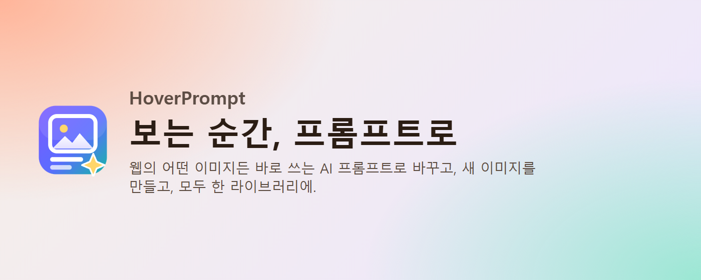
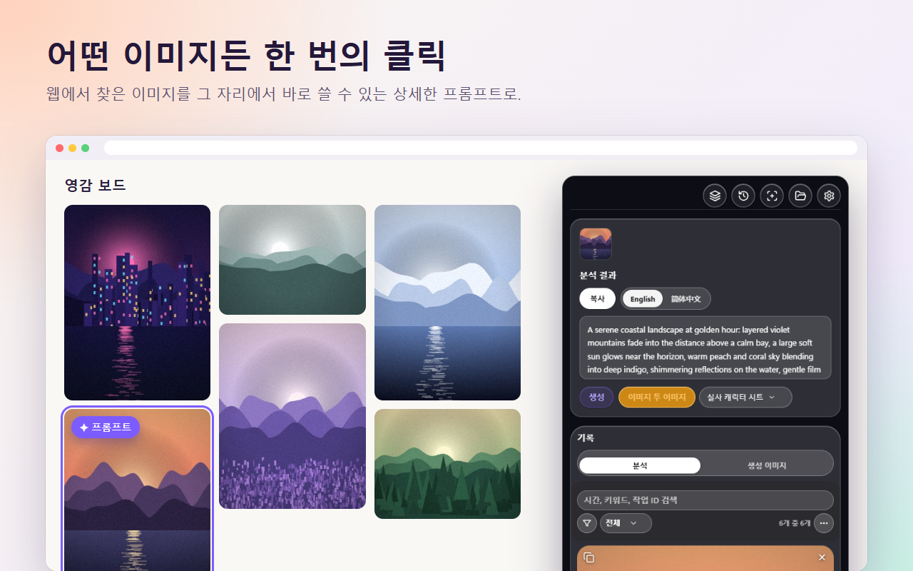
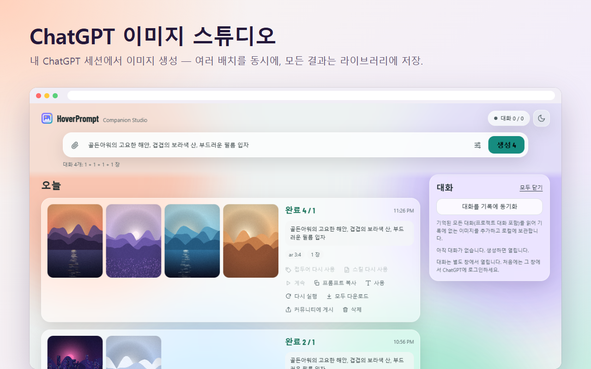
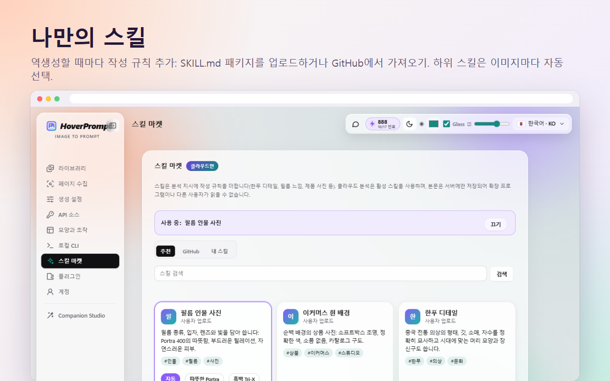
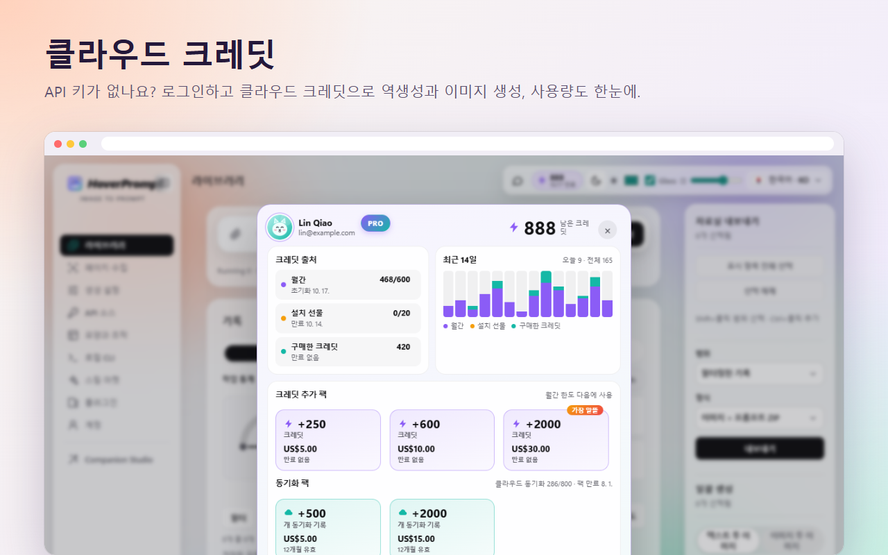
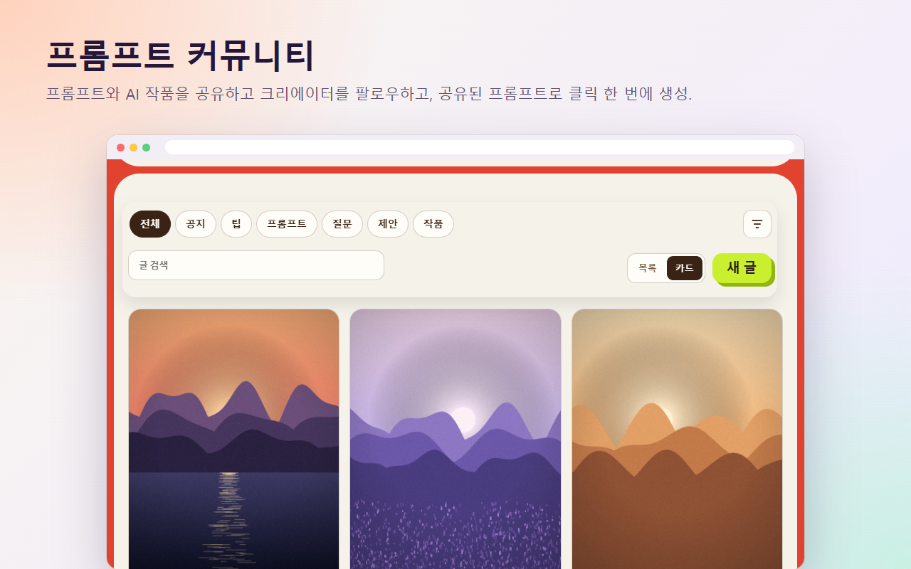
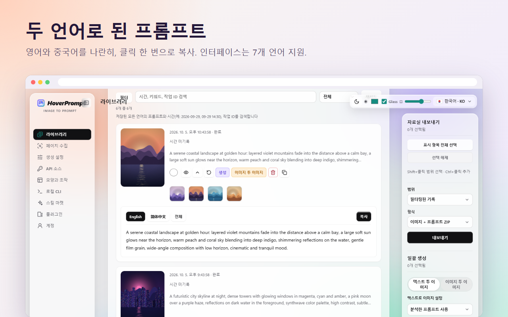
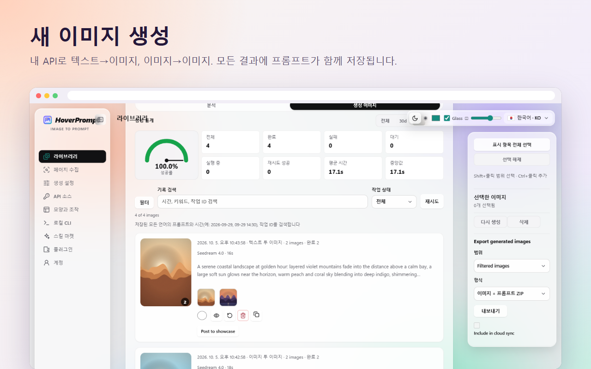
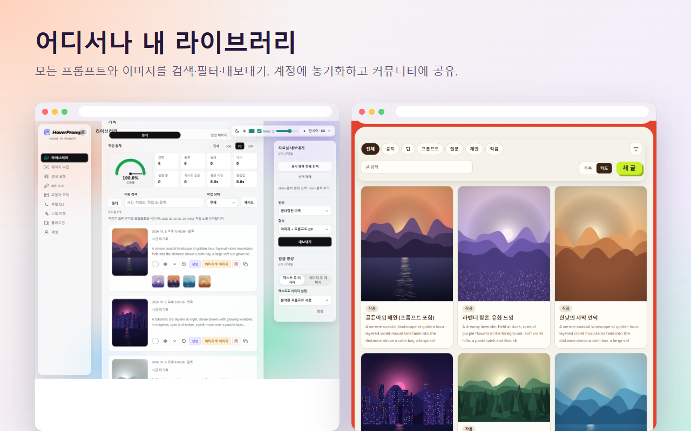

<p align="center"></p>

<h1 align="center">HoverPrompt</h1>

<p align="center">
  <b>올인원 AI 이미지 프롬프트 확장 프로그램.</b><br>
  어떤 이미지도 프롬프트로 반전 · 내 API, ChatGPT 또는 클라우드 크레딧으로 생성 ·<br>
  맞춤 스킬 · 검색 가능한 라이브러리 · 프롬프트 커뮤니티 — Chrome / Edge 확장 하나에.
</p>

<p align="center">
  <a href="https://hoverprompt.com/?lang=ko"><b>웹사이트</b></a> ·
  <a href="https://hoverprompt.com/pricing?lang=ko">요금</a> ·
  <a href="https://hoverprompt.com/community?lang=ko">커뮤니티</a> ·
  <a href="https://hoverprompt.com/models?lang=ko">AI 모델</a> ·
  <a href="README.md">English</a> ·
  <a href="README.zh-CN.md">简体中文</a> ·
  <a href="README.ja.md">日本語</a> ·
  <b>한국어</b> ·
  <a href="README.ru.md">Русский</a> ·
  <a href="README.hi.md">हिन्दी</a> ·
  <a href="README.ar.md">العربية</a>
</p>

---

## 확장 하나에 모두

| | 제공 기능 |
|---|---|
| 🔍 **프롬프트 반전** | 어떤 사이트의 이미지든 마우스를 올리면 → Midjourney, Stable Diffusion, Flux, ChatGPT 등에 쓸 영어·중국어 등 상세 프롬프트 |
| 🎨 **세 가지 생성 방법** | 내 API(OpenAI 호환, Gemini / Imagen, Seedream, ModelScope), 내 ChatGPT 세션의 **ChatGPT Studio**, 키 없이 쓰는 **클라우드 크레딧** |
| 🤖 **ChatGPT Studio** | ChatGPT 웹 페이지로 이미지를 일괄 생성: 여러 대화를 동시에, 참조·비율 지원, 결과 자동 저장 |
| 🧩 **맞춤 스킬** | 매번 반전 프롬프트에 나만의 작성 규칙 추가: `SKILL.md` 패키지 업로드, GitHub에서 가져오기, 이미지마다 고르는 하위 스킬 |
| ☁️ **클라우드 크레딧과 동기화** | 로그인하면 클라우드 반전과 이미지 생성, 크레딧 한눈에 확인, 기기 간 라이브러리 동기화, 무료 7일 Plus 체험 |
| 💬 **커뮤니티** | 프롬프트와 AI 작품 공유, 크리에이터 팔로우, 공유된 프롬프트로 원클릭 생성 |
| 📚 **라이브러리** | 모든 프롬프트와 이미지를 모든 언어로 검색, 성공률과 소요 시간 포함; ZIP으로 내보내기 |
| 🗂️ **페이지 수집과 일괄** | 페이지 전체 참조 이미지 수집(광고·아이콘·중복 건너뜀), Xiaohongshu 노트 전체 반전, 일괄 이미지→이미지 |
| ⌨️ **CLI와 에이전트** | 명령줄이나 AI 에이전트에서 라이브러리 읽기, 페이지 스캔, 파이프라인 실행 |
| 🔒 **로컬 우선** | 계정 없이 동작; API 키는 브라우저 밖으로 나가지 않습니다 |

## 하이라이트

### 어떤 이미지든 한 번의 클릭

그림에 마우스를 올리고 **프롬프트**를 누르면, 그 자리에서 바로 쓸 수 있는 프롬프트를 얻습니다 — 두 언어, 클릭 한 번으로 복사.



### ChatGPT Studio

확장에서 **내 ChatGPT 계정**으로 이미지를 생성하세요. 프롬프트를 쓰거나(또는 참조를 붙여넣고) 비율과 장수를 고르면, HoverPrompt가 여러 ChatGPT 대화를 병렬로 돌리고 모든 이미지를 가져와 프롬프트와 함께 라이브러리에 저장합니다. 다시 실행, 프롬프트 재사용, 커뮤니티 게시까지 원클릭.



### 맞춤 스킬

스킬은 반전 프롬프트에 더하는 작성 규칙입니다 — 필름 감도와 그레인, 흰 배경 상품 사진, 한푸 디테일, 디자인 철학… `SKILL.md` 패키지(하위 스킬과 「언제 사용할지」 조건 포함)를 업로드하거나 GitHub에서 가져오거나 추천을 고르세요. **자동**이면 이미지마다 알맞은 하위 스킬이 선택됩니다.



### 클라우드 크레딧

API 키가 없나요? [hoverprompt.com](https://hoverprompt.com/?lang=ko)에 로그인해 [공개 모델](https://hoverprompt.com/models?lang=ko)(Qwen-Image, FLUX, Z-Image, SDXL…)로 반전과 이미지 생성에 **클라우드 크레딧**을 쓰세요. 크레딧 창에서 출처, 최근 14일 사용량, 만료되지 않는 팩을 볼 수 있습니다. 새 계정은 **무료 7일 Plus 체험**을 받을 수 있습니다 — 카드 불필요.



### 커뮤니티

프롬프트와 이미지를 [HoverPrompt 커뮤니티](https://hoverprompt.com/community?lang=ko)에 올리고, 쇼케이스를 둘러보고, 좋아요·즐겨찾기·팔로우 — **이 프롬프트로 생성**을 누르면 공유된 어떤 프롬프트로든 생성할 수 있습니다.



### 더 보기

| | |
|---|---|
|  |  |
|  | |

## 소스에서 설치

1. 이 저장소를 다운로드하거나 클론합니다.
2. `chrome://extensions`(Chrome) 또는 `edge://extensions`(Edge)를 열고 **개발자 모드**를 켭니다.
3. **압축해제된 확장 프로그램을 로드합니다**를 클릭하고 [`extension`](extension) 폴더를 선택합니다.
4. HoverPrompt를 고정하고, 아무 웹 페이지나 연 뒤 이미지에 마우스를 올립니다.

Chrome 또는 Edge 111 이상이 필요합니다. 빌드 단계 없음: 확장은 일반 JavaScript(Manifest V3)입니다.

**ChatGPT Studio:** **설정 → 플러그인**에서 켠 뒤 사이드바에서 **Companion Studio**를 엽니다. 처음에는 열린 창에서 ChatGPT에 로그인합니다.

## 로그인(선택)

확장 설정 → **계정 및 동기화** → **로그인**을 엽니다. hoverprompt.com 페이지가 열리면 거기서 기기를 승인합니다(이메일 코드 또는 GitHub). 확장은 해당 계정 전용 액세스 토큰만 받습니다 — 비밀번호는 확장에 저장되지 않습니다. 같은 페이지에서 언제든 로그아웃할 수 있습니다.

계정이 있으면: 크레딧으로 클라우드 반전·생성, 스킬 마켓, 기기 간 라이브러리 동기화, 커뮤니티 게시, 무료 7일 Plus 체험. [요금](https://hoverprompt.com/pricing?lang=ko) 참고.

## 내 API 키

로컬 모드에서는 내 모델과 이미지 API를 사용합니다(설정 → **API 소스** 및 **생성**).

- **이 저장소에는 API 키, 토큰, 시크릿이 없습니다.** 자신의 것을 커밋하지 마세요.
- 입력한 키는 브라우저의 확장 저장소(`chrome.storage.local`)에만 저장되며, 설정한 API 엔드포인트로만 전송됩니다. HoverPrompt에는 업로드되지 않습니다.
- 로컬 모델(예: `localhost`의 Ollama)도 동작하며 비용이 없습니다.

## 로컬 CLI

`extension/cli` 폴더에는 확장의 로컬 캐시를 읽는 작은 Node.js CLI와 Native Messaging 브리지가 있습니다:

```powershell
# from the extension folder, on Windows (Chrome / Edge); the ID is shown on chrome://extensions
powershell -ExecutionPolicy Bypass -File cli/install-local-bridge.ps1 -ExtensionId YOUR_EXTENSION_ID
node "$env:LOCALAPPDATA\HoverPrompt\cli\imageprompt.mjs" local doctor
```

그런 다음 **설정 → Local CLI → Local cache bridge**를 켭니다. 모든 명령과 에이전트 안내는 [docs/CLI-AGENT.md](docs/CLI-AGENT.md)를 보세요.

## 프로젝트 구성

```
extension/            the browser extension (Manifest V3), load this folder unpacked
  manifest.json
  background.js       service worker: context menu, tasks, cloud and CLI messages
  content.js          on-page buttons and the floating panel
  app.js, api.js      reverse prompts with local / your own / cloud models
  imagegen*.js        image generation with your own APIs
  chatgpt-*.js        ChatGPT Studio (runs in your own ChatGPT session)
  skills-ui.js        skill market and your own skills
  cloud.js            optional HoverPrompt account: sign-in, sync, credits
  credits-panel.js    the cloud credits window
  community-share.js  posting to the community
  cli/                local CLI and Native Messaging bridge
  _locales/           store name and description (English, Simplified Chinese)
docs/                 screenshots and the CLI / agent guide
```

## 개인정보

로컬 모드에서는 모든 것이 브라우저에 남습니다. 로그인한 뒤에는 동기화를 선택한 내용만 HoverPrompt로 전송됩니다. 전문은 [개인정보 처리방침](https://hoverprompt.com/privacy?lang=ko), [서비스 약관](https://hoverprompt.com/terms?lang=ko), [이용 정책](https://hoverprompt.com/acceptable-use?lang=ko)을 참고하세요.

ChatGPT Studio는 내 브라우저에서 내 계정으로 ChatGPT 웹 페이지를 조작합니다; HoverPrompt는 OpenAI와 제휴하지 않습니다. 연결하는 서비스의 약관에 맞게 사용하세요.

## 기여

이슈와 풀 리퀘스트를 환영합니다. 변경은 작고 집중되게 유지하고, 압축해제된 확장으로 로드해 테스트한 뒤, 커밋에 API 키나 개인 데이터를 넣지 마세요.

## 라이선스

[MIT](LICENSE) © 2026 HoverPrompt. 글꼴은 SIL Open Font License([extension/fonts/OFL.txt](extension/fonts/OFL.txt)); 아이콘은 [Lucide](https://lucide.dev)([extension/icons/LUCIDE-LICENSE.txt](extension/icons/LUCIDE-LICENSE.txt)).

HoverPrompt 이름과 로고는 공식 확장과 웹사이트를 나타냅니다; 자체 빌드에는 다른 이름과 로고를 사용해 주세요.
