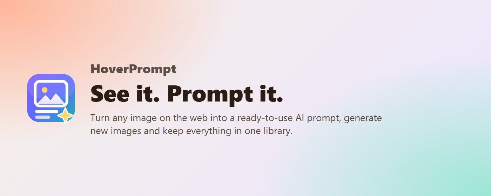
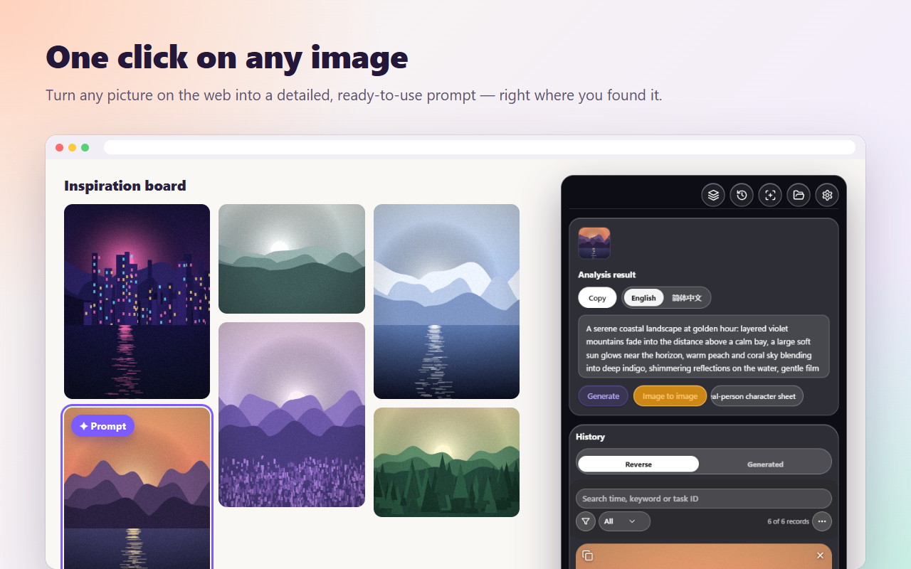
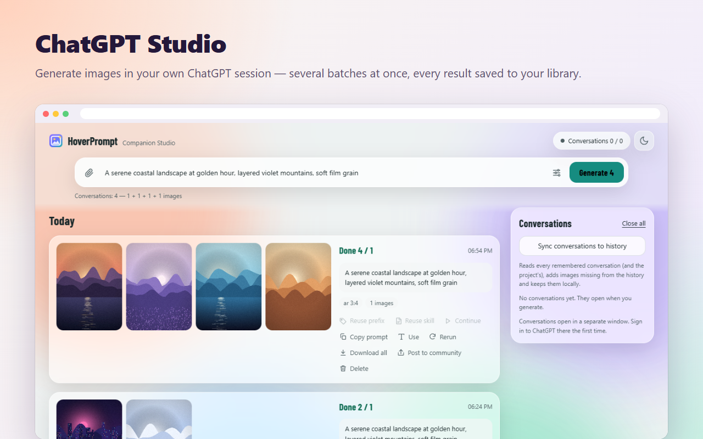
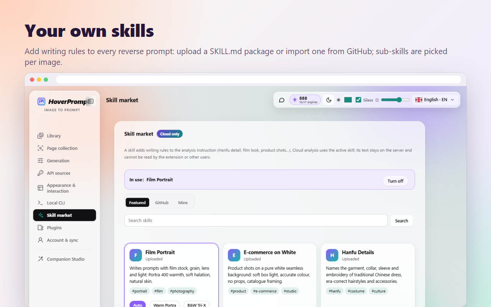
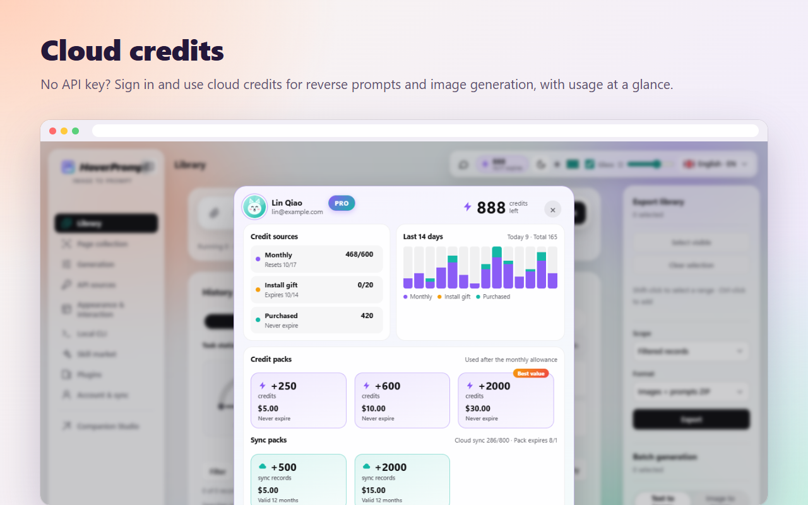
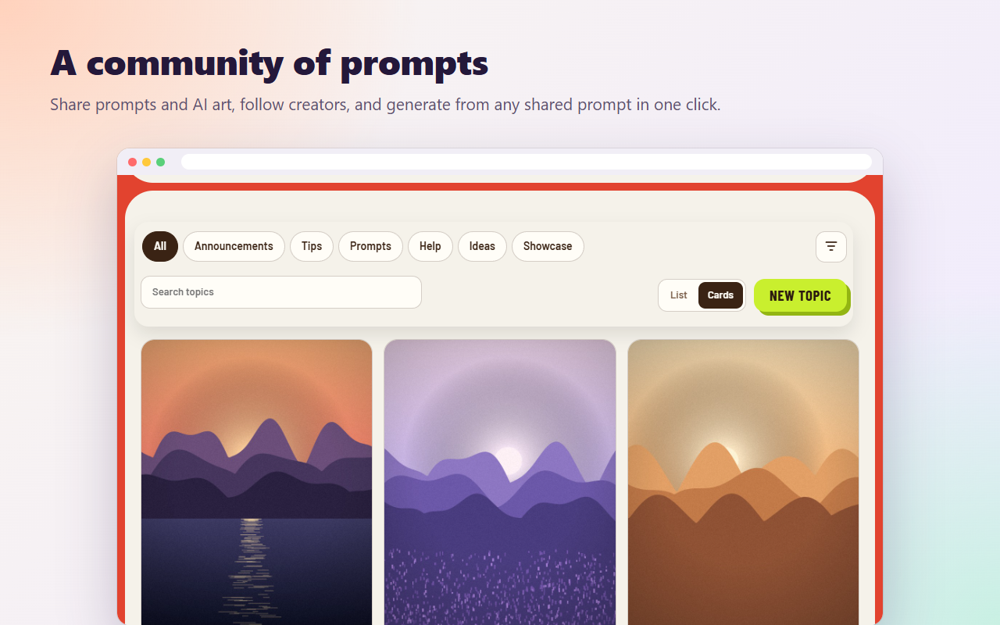
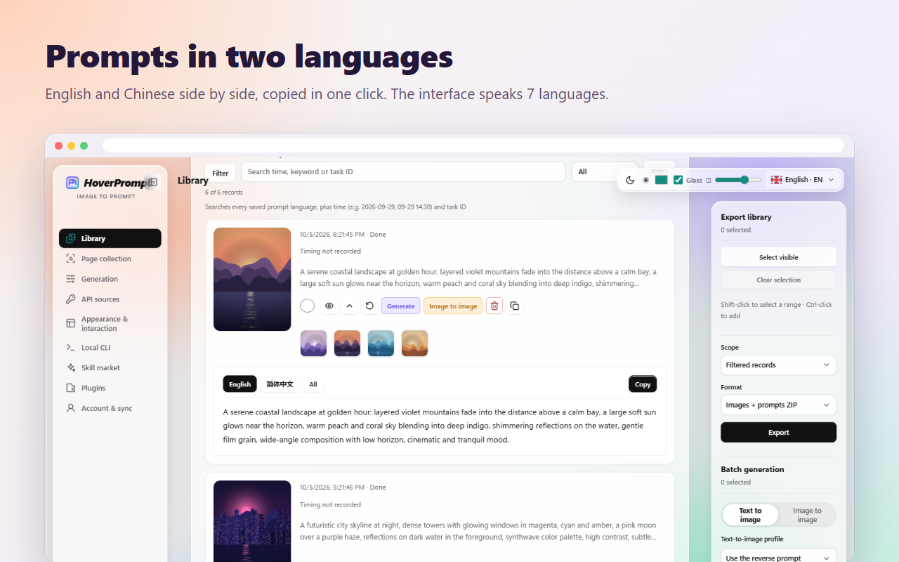
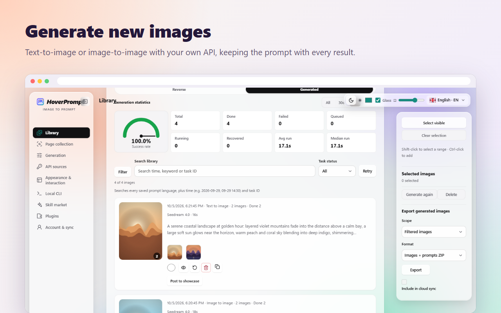
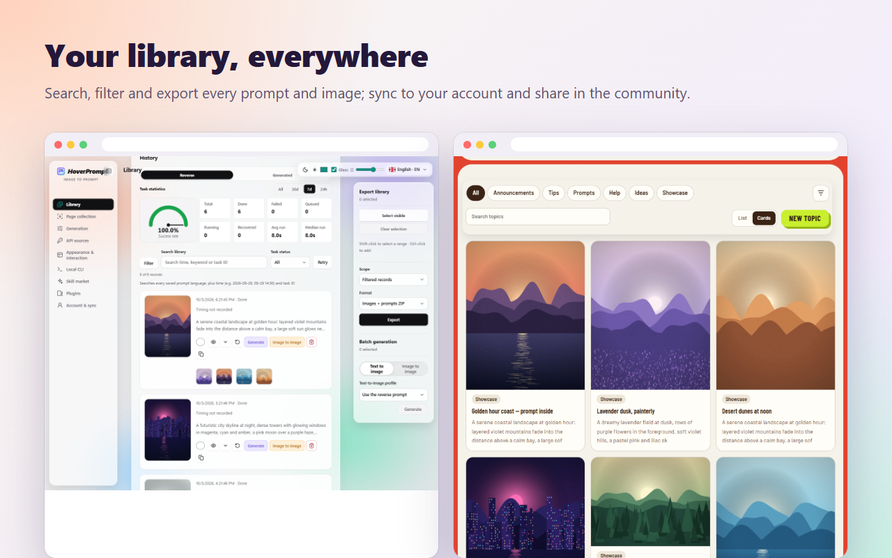

<p align="center"></p>

<h1 align="center">HoverPrompt</h1>

<p align="center">
  <b>The all-in-one AI image prompt extension.</b><br>
  Reverse any image into a prompt · generate with your own API, ChatGPT or cloud credits ·<br>
  custom skills · a searchable library · a prompt community · a **CLI** that uses your account credits
  and can drive the extension to auto-scan images and generate prompts — in one Chrome / Edge extension.
</p>

<p align="center">
  <a href="https://hoverprompt.com"><b>Website</b></a> ·
  <a href="https://hoverprompt.com/pricing">Pricing</a> ·
  <a href="https://hoverprompt.com/community">Community</a> ·
  <a href="https://hoverprompt.com/models">AI Models</a> ·
  <b>English</b> ·
  <a href="README.zh-CN.md">简体中文</a> ·
  <a href="README.ja.md">日本語</a> ·
  <a href="README.ko.md">한국어</a> ·
  <a href="README.ru.md">Русский</a> ·
  <a href="README.hi.md">हिन्दी</a> ·
  <a href="README.ar.md">العربية</a>
</p>

<p align="center"><b>🆓 Free to use</b> — the extension is free; bring your own API key or run Ollama locally, no account needed.<br>
Custom AI providers supported (OpenAI Chat/Responses, Anthropic, Gemini, Ollama; image gen: OpenAI-compatible, ModelScope, Gemini/Imagen, Seedream). Keys are encrypted (AES-256-GCM) in <code>chrome.storage.local</code> on this device only — never synced or uploaded.<br>
Optional cloud: <b>40</b> reverse prompts / month on Free, plus a <b>20</b>-credit install gift; Plus and credit packs are optional.</p>


---

## Everything in one extension

| | What you get |
|---|---|
| 🔍 **Reverse prompts** | Hover any image on any site → a detailed prompt in English, Chinese and more languages, for Midjourney, Stable Diffusion, Flux, ChatGPT… |
| 🎨 **Three ways to generate** | Your own API (OpenAI-compatible, Gemini / Imagen, Seedream, ModelScope), **ChatGPT Studio** in your own ChatGPT session, or **cloud credits** with no key at all |
| 🤖 **ChatGPT Studio** | Batch image generation through the ChatGPT web page: several conversations at once, references, ratios, results saved automatically |
| 🧩 **Custom skills** | Your own writing rules for every reverse prompt: upload a `SKILL.md` package, import from GitHub, sub-skills picked per image |
| ☁️ **Cloud credits & sync** | Sign in for cloud reverse prompts and image generation, credits at a glance, library sync across devices, a free 7-day Plus trial |
| 💬 **Community** | Share prompts and AI art, follow creators, generate from any shared prompt in one click |
| 📚 **Library** | Every prompt and image, searchable in every language, with success rates and timings; export as a ZIP |
| 🗂️ **Page collection & batch** | Collect a whole page of references (ads, icons and duplicates skipped), reverse a whole Xiaohongshu note, batch image-to-image |
| ⌨️ **CLI & agents** | **Highlight:** connect to your HoverPrompt **account credits**, or control the extension to **auto-scan images and generate prompts**; also read the library and hand ready-made instructions to an AI agent |
| 🔒 **Local first** | Works without an account; your API keys never leave your browser and are stored encrypted |


> Built for **designers**, **creatives**, **product** teams and **AI film & video** makers.

## CLI — account credits & extension control

The Node.js CLI in [`extension/cli`](extension/cli) (`imageprompt.mjs`) is a first-class part of HoverPrompt:

1. **Connect to your account quota** — `login` opens a device-approval page on [hoverprompt.com](https://hoverprompt.com); then `analyze` / `batch` use your **cloud credits** (server-enforced). `me` shows your quota.
2. **Control the extension** — install the Native Messaging bridge (Windows / Chrome / Edge), enable **Settings → Local CLI**, and use `local search` / `local scan` + `local submit` so the extension **automatically recognizes page images and queues reverse prompts**.

```powershell
# from the extension/ folder; Extension ID is on chrome://extensions (or Settings → Local CLI)
powershell -ExecutionPolicy Bypass -File cli/install-local-bridge.ps1 -ExtensionId YOUR_EXTENSION_ID
$cli = Join-Path $env:LOCALAPPDATA 'HoverPrompt\cli\imageprompt.mjs'

# Account credits (cloud API; works wherever Node can reach hoverprompt.com)
node $cli login
node $cli me
node $cli analyze photo.jpg --wait true

# Drive the extension: find images, then auto-generate prompts (uses the extension's configured channel)
# Enable “Local cache bridge” and “Allow CLI to scan pages and submit tasks” in Settings → Local CLI
node $cli local doctor
node $cli local search --site pinterest.com --query "film portrait" --scope scroll
node $cli local submit --scan-id SCAN_ID --limit 20
node $cli local get TASK_ID
```

`local search` / `local scan` only collect image URLs (no model call). `local submit` may use your personal API or **cloud credits**, depending on the extension’s service mode. Token file: `~/.hoverprompt/credentials.json` (or `IMAGEPROMPT_TOKEN`). Full command list: [docs/CLI-AGENT.md](docs/CLI-AGENT.md).

## Highlights

### One click on any image

Hover a picture, press **Prompt**, and get a ready-to-use prompt where you found it — in two languages, copied in one click.



### ChatGPT Studio

Generate images with **your own ChatGPT account** right from the extension. Write a prompt (or paste references), choose the ratio and how many images, and HoverPrompt runs several ChatGPT conversations in parallel, fetches every image and saves it to your library with its prompt. Rerun, reuse the prompt or post the result to the community in one click.



### Custom skills

A skill is a set of writing rules added to the reverse prompt — film stock and grain, product shots on white, Hanfu garment details, a design philosophy… Upload your own `SKILL.md` package (with sub-skills and their "use when" conditions), import one from GitHub, or pick a featured one. With **Auto**, the right sub-skill is chosen for each image.



### Cloud credits

No API key? Sign in to [hoverprompt.com](https://hoverprompt.com) and use **cloud credits** for reverse prompts and image generation with the [named models](https://hoverprompt.com/models) (Qwen-Image, FLUX, Z-Image, SDXL…). The credits window shows where your credits come from, the last 14 days of use, and packs that never expire. New accounts can claim a **free 7-day Plus trial** — no card needed.



### Community

Post your prompts and images to the [HoverPrompt community](https://hoverprompt.com/community), browse the showcase, like, favourite and follow — and press **Generate with this prompt** to generate from any shared prompt.



### And more

| | |
|---|---|
|  |  |
|  | |

## Install from source

1. Download or clone this repository.
2. Open `chrome://extensions` (Chrome) or `edge://extensions` (Edge) and turn on **Developer mode**.
3. Click **Load unpacked** and choose the [`extension`](extension) folder.
4. Pin HoverPrompt, open any web page and hover an image.

Requires Chrome or Edge 111 or later. No build step: the extension is plain JavaScript (Manifest V3).

**ChatGPT Studio:** turn it on in **Settings → Plugins**, then open **Companion Studio** from the sidebar. The first time, sign in to ChatGPT in the window it opens.

## Sign in (optional)

Open the extension settings → **Account & sync** → **Sign in**. A page on hoverprompt.com opens; approve the device there (email code or GitHub). The extension then receives an access token for your account only — no password is stored in the extension. Sign out from the same page at any time.

With an account: cloud reverse prompts and generation with credits, the skill market, library sync across devices, posting to the community, and the free 7-day Plus trial. See [pricing](https://hoverprompt.com/pricing).

## Your own API keys

In local mode you bring your own model and image APIs (settings → **API sources** and **Generation**).

- **This repository contains no API keys, tokens or secrets.** Never commit yours.
- Keys you enter are stored encrypted (AES-256-GCM) only in the browser's extension storage (`chrome.storage.local`) and sent only to the API endpoint you configured. They are never uploaded to HoverPrompt.

## Project layout

```
extension/            the browser extension (Manifest V3), load this folder unpacked
  manifest.json
  background.js       service worker: context menu, tasks, cloud and CLI messages
  content.js          on-page buttons and the floating panel
  app.js, api.js      reverse prompts with local / your own / cloud models
  imagegen*.js        image generation with your own APIs
  chatgpt-*.js        ChatGPT Studio (runs in your own ChatGPT session)
  skills-ui.js        skill market and your own skills
  cloud.js            optional HoverPrompt account: sign-in, sync, credits
  credits-panel.js    the cloud credits window
  community-share.js  posting to the community
  cli/                local CLI and Native Messaging bridge
  _locales/           store name and description (English, Simplified Chinese)
docs/                 screenshots and the CLI / agent guide
```

## Privacy

Local mode keeps everything in your browser. When you sign in, only what you choose to sync is sent to HoverPrompt. Read the full [Privacy Policy](https://hoverprompt.com/privacy), [Terms of Service](https://hoverprompt.com/terms) and [Acceptable Use Policy](https://hoverprompt.com/acceptable-use).

ChatGPT Studio drives the ChatGPT web page in your own browser with your own account; HoverPrompt is not affiliated with OpenAI. Use it in line with the terms of the services you connect.

## Contributing

Issues and pull requests are welcome. Please keep changes small and focused, test them by loading the extension unpacked, and never include API keys or personal data in commits.

## License

[HoverPrompt Source-Available License 1.0](LICENSE) © 2026 HoverPrompt: free to use as a tool, including for paid work. Building a commercial product or service from the code, or redistributing modified or paid copies, needs written authorization (support@hoverprompt.com). Versions up to v3.10.9 were released under the MIT License. Fonts are under the SIL Open Font License ([extension/fonts/OFL.txt](extension/fonts/OFL.txt)); icons are from [Lucide](https://lucide.dev) ([extension/icons/LUCIDE-LICENSE.txt](extension/icons/LUCIDE-LICENSE.txt)).

The HoverPrompt name and logo identify the official extension and website; please use a different name and logo for your own builds.
