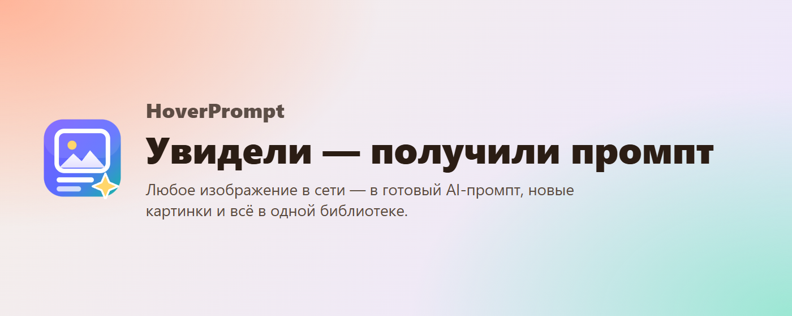
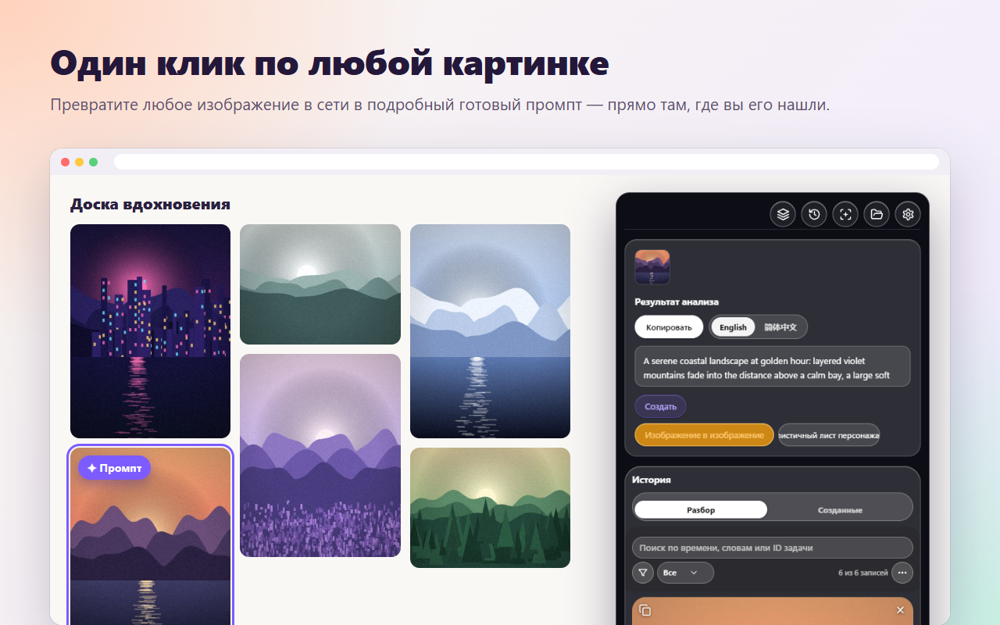
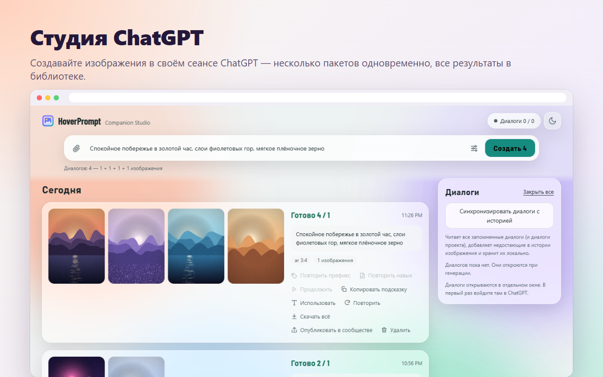
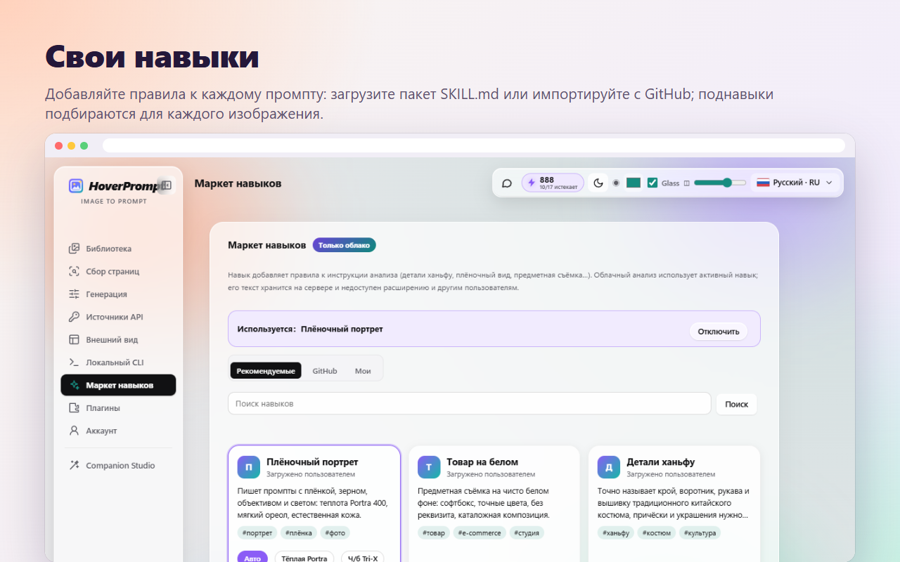
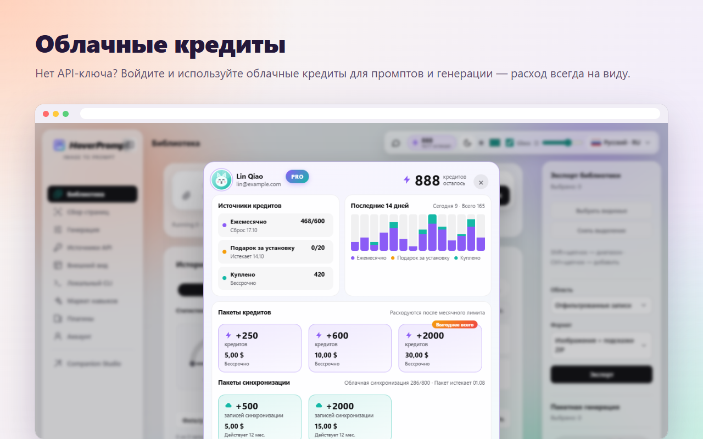
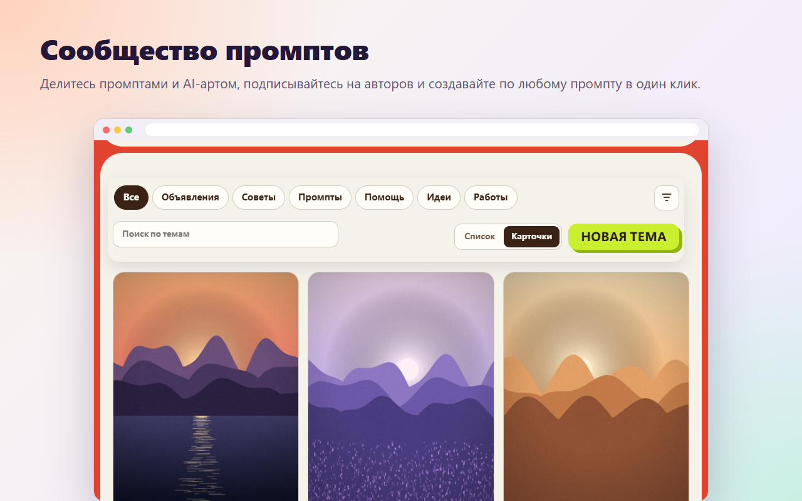
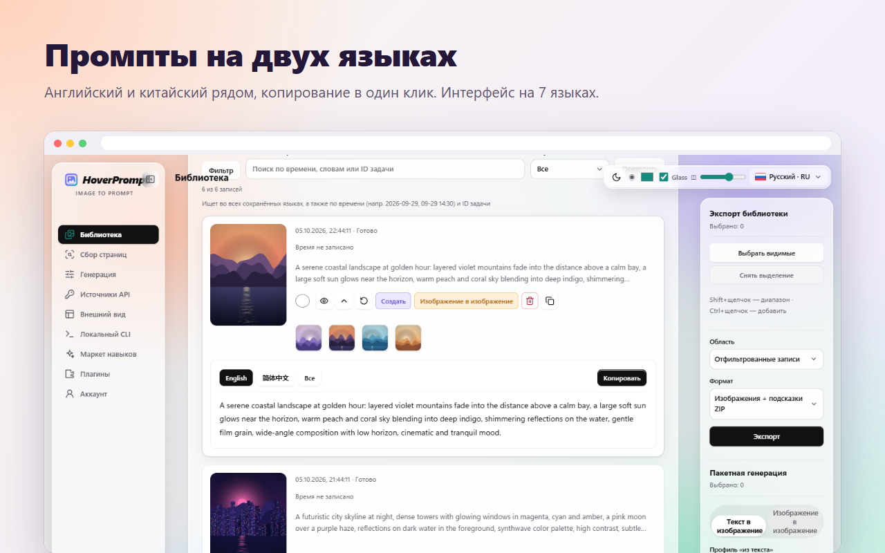
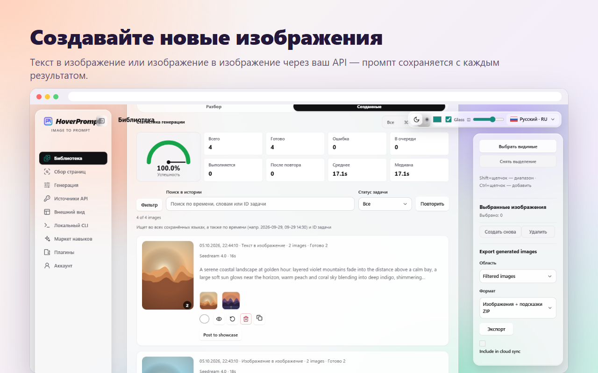
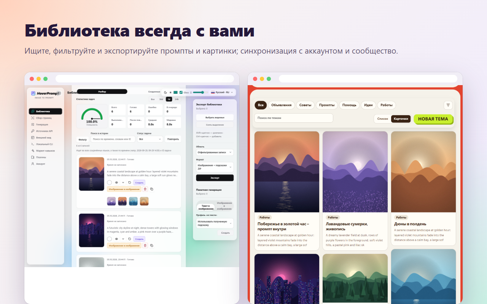

<p align="center"></p>

<h1 align="center">HoverPrompt</h1>

<p align="center">
  <b>Универсальное расширение для AI-промптов по изображениям.</b><br>
  Реверс любого изображения в промпт · генерация своим API, через ChatGPT или облачные кредиты ·<br>
  свои навыки · библиотека с поиском · сообщество промптов · **CLI** (квота аккаунта и управление расширением для авто-распознавания изображений и генерации промптов) — в одном расширении Chrome / Edge.
</p>

<p align="center">
  <a href="https://hoverprompt.com/?lang=ru"><b>Сайт</b></a> ·
  <a href="https://hoverprompt.com/pricing?lang=ru">Цены</a> ·
  <a href="https://hoverprompt.com/community?lang=ru">Сообщество</a> ·
  <a href="https://hoverprompt.com/models?lang=ru">AI-модели</a> ·
  <a href="README.md">English</a> ·
  <a href="README.zh-CN.md">简体中文</a> ·
  <a href="README.ja.md">日本語</a> ·
  <a href="README.ko.md">한국어</a> ·
  <b>Русский</b> ·
  <a href="README.hi.md">हिन्दी</a> ·
  <a href="README.ar.md">العربية</a>
</p>

<p align="center"><b>🆓 Бесплатно</b> — само расширение бесплатно; локальный режим / свой API без аккаунта.<br>
Облако по желанию: на Free <b>10</b> реверсов в месяц и подарок за установку <b>20</b> кредитов; Plus и пакеты — опционально.</p>


---

## Всё в одном расширении

| | Что вы получаете |
|---|---|
| 🔍 **Реверс промптов** | Наведите курсор на любое изображение на любом сайте → подробный промпт на английском, китайском и других языках для Midjourney, Stable Diffusion, Flux, ChatGPT… |
| 🎨 **Три способа генерации** | Свой API (совместимый с OpenAI, Gemini / Imagen, Seedream, ModelScope), **ChatGPT Studio** в вашей сессии ChatGPT или **облачные кредиты** без ключа |
| 🤖 **ChatGPT Studio** | Пакетная генерация изображений через веб-страницу ChatGPT: несколько диалогов сразу, референсы, соотношения сторон, результаты сохраняются автоматически |
| 🧩 **Свои навыки (skills)** | Собственные правила письма для каждого реверс-промпта: загрузите пакет `SKILL.md`, импортируйте с GitHub, поднавыки выбираются для каждого изображения |
| ☁️ **Облачные кредиты и синхронизация** | Войдите для облачного реверса и генерации, кредиты под рукой, синхронизация библиотеки между устройствами, бесплатный 7-дневный пробный период Plus |
| 💬 **Сообщество** | Делитесь промптами и AI-артом, подписывайтесь на авторов, генерируйте по любому общему промпту в один клик |
| 📚 **Библиотека** | Все промпты и изображения с поиском на любом языке, с долей успеха и временем; экспорт в ZIP |
| 🗂️ **Сбор со страницы и пакетная обработка** | Соберите референсы со всей страницы (реклама, иконки и дубли пропускаются), реверс всей заметки Xiaohongshu, пакетное изображение→изображение |
| ⌨️ **CLI и агенты** | **Акцент:** подключение к **кредитам аккаунта** HoverPrompt или управление расширением для **авто-сканирования изображений и генерации промптов**; также чтение библиотеки и инструкции для AI-агента |
| 🔒 **Сначала локально** | Работает без аккаунта; ваши API-ключи не покидают браузер |


> Создано для **дизайнеров**, **креативщиков**, **продуктовых** команд и авторов **AI‑кино и видео**.

## CLI — кредиты аккаунта и управление расширением

Node.js CLI в [`extension/cli`](extension/cli) (`imageprompt.mjs`) — полноценная часть HoverPrompt:

1. **Квота аккаунта** — `login` открывает подтверждение устройства на [hoverprompt.com](https://hoverprompt.com); затем `analyze` / `batch` расходуют **облачные кредиты**. `me` показывает квоту.
2. **Управление расширением** — установите мост Native Messaging (Windows / Chrome / Edge), включите **Настройки → Local CLI**, используйте `local search` / `local scan` + `local submit`, чтобы расширение **само находило изображения на странице и ставило задачи на обратный промпт**.

```powershell
powershell -ExecutionPolicy Bypass -File cli/install-local-bridge.ps1 -ExtensionId YOUR_EXTENSION_ID
$cli = Join-Path $env:LOCALAPPDATA 'HoverPrompt\cli\imageprompt.mjs'

node $cli login
node $cli me
node $cli analyze photo.jpg --wait true

node $cli local doctor
node $cli local search --site pinterest.com --query "film portrait" --scope scroll
node $cli local submit --scan-id SCAN_ID --limit 20
node $cli local get TASK_ID
```

`local search` / `local scan` только собирают URL (без вызова модели). `local submit` использует личный API или **облачные кредиты** — как настроено в расширении. Токен: `~/.hoverprompt/credentials.json` (или `IMAGEPROMPT_TOKEN`). Полный список: [docs/CLI-AGENT.md](docs/CLI-AGENT.md).

## Основные возможности

### Один клик по любому изображению

Наведите курсор на картинку, нажмите **Промпт** — и получите готовый промпт там, где нашли изображение: на двух языках, копирование в один клик.



### ChatGPT Studio

Генерируйте изображения из расширения через **свой аккаунт ChatGPT**. Напишите промпт (или вставьте референсы), выберите соотношение сторон и число изображений — HoverPrompt запустит несколько диалогов ChatGPT параллельно, заберёт каждое изображение и сохранит его в библиотеку вместе с промптом. Перезапуск, повторное использование промпта или публикация в сообществе — в один клик.



### Свои навыки (skills)

Навык — набор правил письма, добавляемых к реверс-промпту: плёнка и зерно, товарные кадры на белом, детали ханьфу, дизайн-философия… Загрузите свой пакет `SKILL.md` (с поднавыками и условиями «когда использовать»), импортируйте с GitHub или выберите рекомендованный. В режиме **Авто** для каждого изображения выбирается подходящий поднавык.



### Облачные кредиты

Нет API-ключа? Войдите на [hoverprompt.com](https://hoverprompt.com/?lang=ru) и используйте **облачные кредиты** для реверса и генерации с [указанными моделями](https://hoverprompt.com/models?lang=ru) (Qwen-Image, FLUX, Z-Image, SDXL…). Окно кредитов показывает, откуда они, использование за последние 14 дней и пакеты без срока действия. Новые аккаунты могут получить **бесплатный 7-дневный пробный период Plus** — карта не нужна.



### Сообщество

Публикуйте промпты и изображения в [сообществе HoverPrompt](https://hoverprompt.com/community?lang=ru), смотрите витрину, ставьте лайки, добавляйте в избранное и подписывайтесь — и нажмите **Сгенерировать с этим промптом**, чтобы создать изображение по любому общему промпту.



### И ещё

| | |
|---|---|
|  |  |
|  | |

## Установка из исходников

1. Скачайте или клонируйте этот репозиторий.
2. Откройте `chrome://extensions` (Chrome) или `edge://extensions` (Edge) и включите **режим разработчика**.
3. Нажмите **Загрузить распакованное расширение** и выберите папку [`extension`](extension).
4. Закрепите HoverPrompt, откройте любую веб-страницу и наведите курсор на изображение.

Нужен Chrome или Edge 111 или новее. Без сборки: расширение — обычный JavaScript (Manifest V3).

**ChatGPT Studio:** включите в **Настройки → Плагины**, затем откройте **Companion Studio** из боковой панели. В первый раз войдите в ChatGPT в открывшемся окне.

## Вход (необязательно)

Откройте настройки расширения → **Аккаунт и синхронизация** → **Войти**. Откроется страница на hoverprompt.com; подтвердите устройство там (код по email или GitHub). Расширение получит только токен доступа вашего аккаунта — пароль в расширении не хранится. Выйти можно с той же страницы в любой момент.

С аккаунтом: облачный реверс и генерация за кредиты, рынок навыков, синхронизация библиотеки между устройствами, публикация в сообществе и бесплатный 7-дневный пробный период Plus. См. [цены](https://hoverprompt.com/pricing?lang=ru).

## Свои API-ключи

В локальном режиме вы подключаете свои модели и API изображений (настройки → **Источники API** и **Генерация**).

- **В этом репозитории нет API-ключей, токенов и секретов.** Не коммитьте свои.
- Введённые ключи хранятся только в хранилище расширения браузера (`chrome.storage.local`) и отправляются только на настроенный вами API-эндпоинт. На HoverPrompt они не загружаются.
- Локальные модели (например Ollama на `localhost`) тоже работают и ничего не стоят.


## Структура проекта

```
extension/            the browser extension (Manifest V3), load this folder unpacked
  manifest.json
  background.js       service worker: context menu, tasks, cloud and CLI messages
  content.js          on-page buttons and the floating panel
  app.js, api.js      reverse prompts with local / your own / cloud models
  imagegen*.js        image generation with your own APIs
  chatgpt-*.js        ChatGPT Studio (runs in your own ChatGPT session)
  skills-ui.js        skill market and your own skills
  cloud.js            optional HoverPrompt account: sign-in, sync, credits
  credits-panel.js    the cloud credits window
  community-share.js  posting to the community
  cli/                local CLI and Native Messaging bridge
  _locales/           store name and description (English, Simplified Chinese)
docs/                 screenshots and the CLI / agent guide
```

## Конфиденциальность

В локальном режиме всё остаётся в браузере. После входа на HoverPrompt отправляется только то, что вы выбрали для синхронизации. Полный текст: [Политика конфиденциальности](https://hoverprompt.com/privacy?lang=ru), [Условия использования](https://hoverprompt.com/terms?lang=ru) и [Политика допустимого использования](https://hoverprompt.com/acceptable-use?lang=ru).

ChatGPT Studio управляет веб-страницей ChatGPT в вашем браузере с вашим аккаунтом; HoverPrompt не связан с OpenAI. Используйте в соответствии с условиями подключаемых сервисов.

## Участие

Issues и pull request приветствуются. Держите изменения небольшими и сфокусированными, тестируйте загрузкой распакованного расширения и никогда не включайте API-ключи или личные данные в коммиты.

## Лицензия

[MIT](LICENSE) © 2026 HoverPrompt. Шрифты — под SIL Open Font License ([extension/fonts/OFL.txt](extension/fonts/OFL.txt)); иконки — из [Lucide](https://lucide.dev) ([extension/icons/LUCIDE-LICENSE.txt](extension/icons/LUCIDE-LICENSE.txt)).

Имя и логотип HoverPrompt обозначают официальное расширение и сайт; для своих сборок используйте другое имя и логотип.
