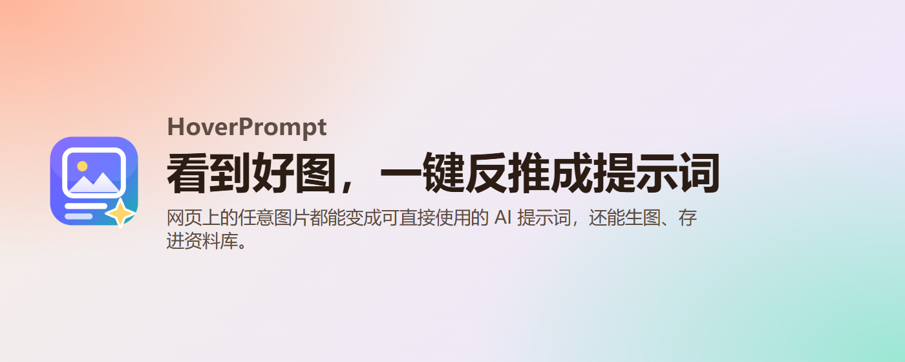
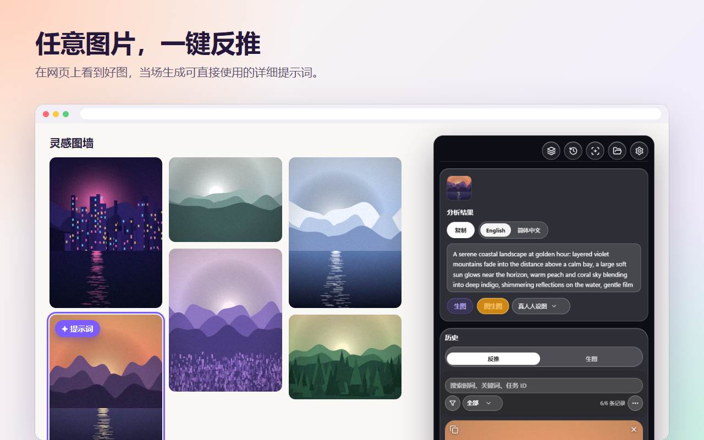
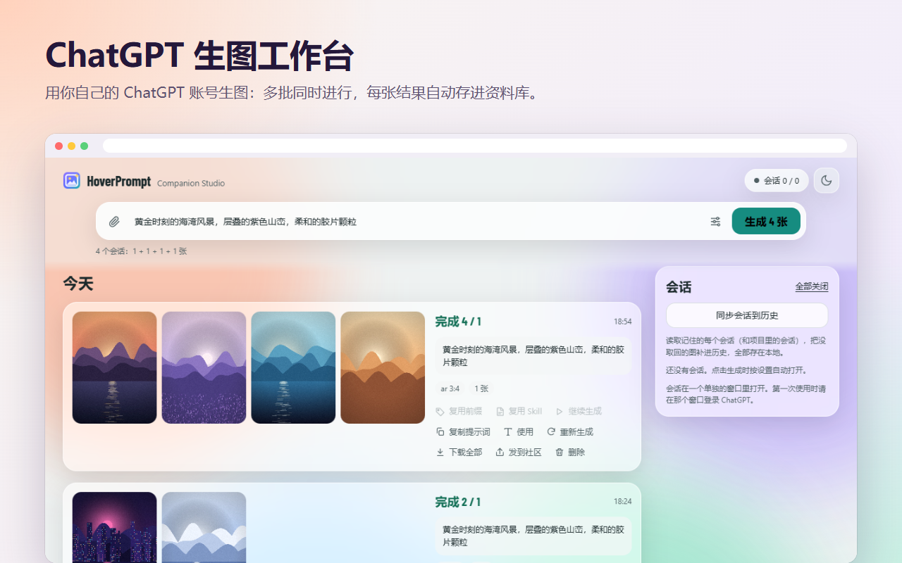
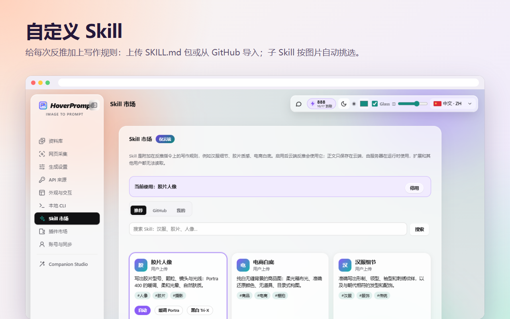
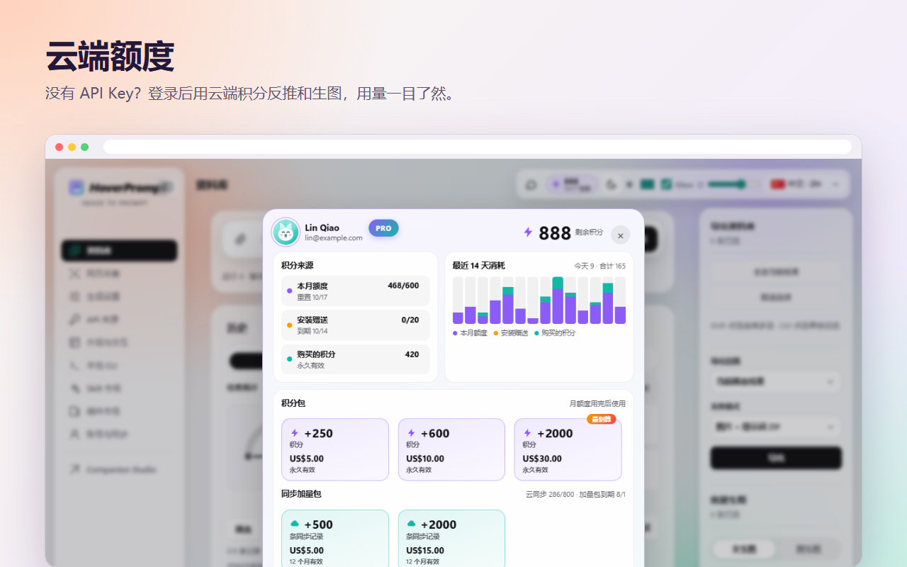
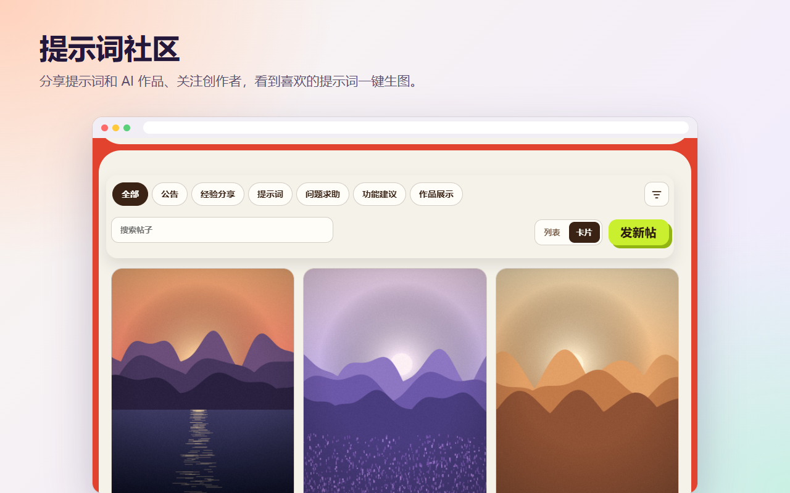
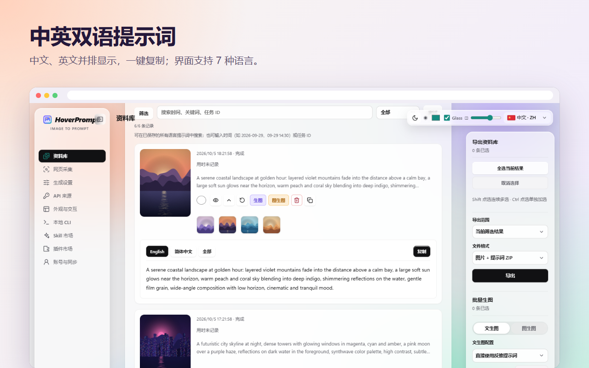
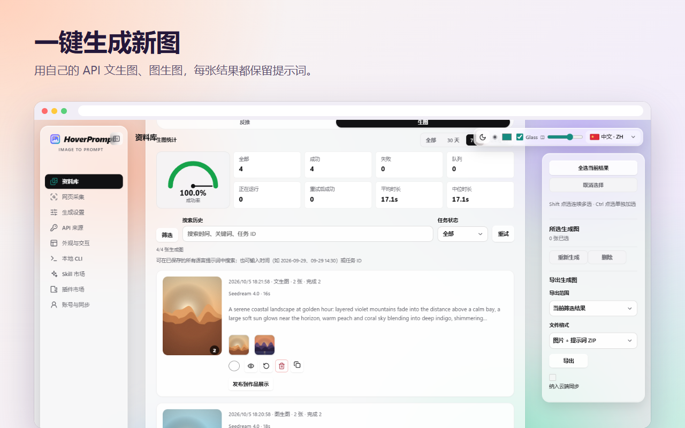
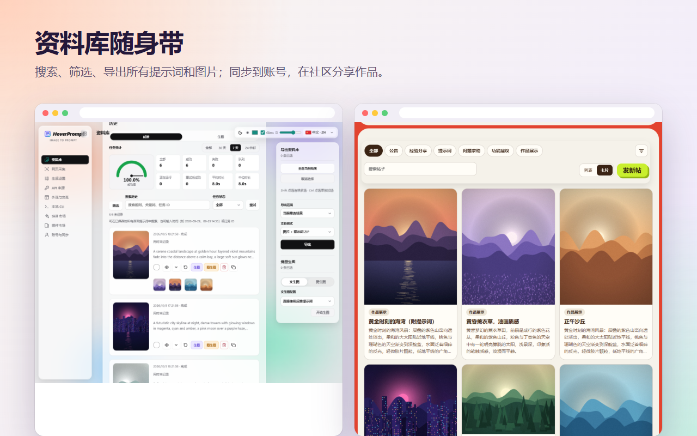

<p align="center"></p>

<h1 align="center">HoverPrompt</h1>

<p align="center">
  <b>功能全面的一站式 AI 生图提示词扩展。</b><br>
  任意图片反推提示词 · 用自己的 API、ChatGPT 或云端积分生图 ·<br>
  自定义 Skill · 可搜索的资料库 · 提示词社区 · **CLI**（可连接账号额度，并可控制扩展自动识别图片、生成提示词）—— 全在一个 Chrome / Edge 扩展里。
</p>

<p align="center">
  <a href="https://hoverprompt.com/?lang=zh-CN"><b>官网</b></a> ·
  <a href="https://hoverprompt.com/pricing?lang=zh-CN">价格</a> ·
  <a href="https://hoverprompt.com/community?lang=zh-CN">社区</a> ·
  <a href="https://hoverprompt.com/models?lang=zh-CN">AI 模型说明</a> ·
  <a href="README.md">English</a> ·
  <b>简体中文</b> ·
  <a href="README.ja.md">日本語</a> ·
  <a href="README.ko.md">한국어</a> ·
  <a href="README.ru.md">Русский</a> ·
  <a href="README.hi.md">हिन्दी</a> ·
  <a href="README.ar.md">العربية</a>
</p>

<p align="center"><b>🆓 免费使用</b> — 插件本体免费；可自定义 AI 模型来源，只需填写自己的 API Key（或本机 Ollama），无需账号。<br>
支持 OpenAI Chat/Responses、Anthropic、Gemini、Ollama；生图另支持 OpenAI 兼容、魔搭 ModelScope、Gemini/Imagen、火山方舟 Seedream。密钥以 AES-256-GCM 加密后只保存在本机浏览器 <code>chrome.storage.local</code>，不同步、不上传。<br>
可选云端：免费版每月 <b>10</b> 次反推，另有安装赠送 <b>20</b> 积分；Plus 与积分包为可选项。</p>


---

## 一个扩展，全部搞定

| | 功能 |
|---|---|
| 🔍 **一键反推** | 在任何网站把鼠标移到图片上 → 得到中文、英文（还可以加其他语言）的详细提示词，适用于 Midjourney、Stable Diffusion、Flux、ChatGPT 等 |
| 🎨 **三种生图方式** | 用自己的 API（OpenAI 兼容、Gemini / Imagen、火山方舟 Seedream、魔搭 ModelScope），用 **ChatGPT 生图工作台**（你自己的 ChatGPT 账号），或者完全不用 Key、直接用**云端积分** |
| 🤖 **ChatGPT 生图工作台** | 通过 ChatGPT 网页批量生图：多个会话同时进行，支持参考图和画幅比例，结果自动保存 |
| 🧩 **自定义 Skill** | 给每次反推加上你自己的写作规则：上传 `SKILL.md` 包、从 GitHub 导入，子 Skill 按图片自动挑选 |
| ☁️ **云端额度与同步** | 登录后可用云端反推和生图，积分用量一目了然，资料库多设备同步，还能免费体验 7 天 Plus |
| 💬 **提示词社区** | 分享提示词和 AI 作品、关注创作者，看到喜欢的提示词一键生图 |
| 📚 **资料库** | 所有提示词和图片都在这里，支持全语言搜索，有成功率和耗时统计；可导出为 ZIP |
| 🗂️ **整页采集与批量** | 整页收集参考图（自动跳过广告、图标和重复图），小红书笔记整篇反推，批量图生图 |
| ⌨️ **CLI 与 Agent** | **重点：** 可连接 HoverPrompt **账号额度（积分）**；也可通过本地桥接**控制扩展**自动识别网页图片并生成提示词；同时可读资料库、把现成指令交给 AI Agent |
| 🔒 **本地优先** | 不登录也能用；你的 API Key 不会离开浏览器，且加密保存 |


> 面向**设计**、**创意**、**产品**与 **AI 影视**创作者打造。

## CLI — 连接账号额度 & 控制扩展

[`extension/cli`](extension/cli) 里的 Node.js CLI（`imageprompt.mjs`）是 HoverPrompt 的一等能力：

1. **连接账号额度** — `login` 在 [hoverprompt.com](https://hoverprompt.com/?lang=zh-CN) 完成设备授权；之后 `analyze` / `batch` 会消耗你的**云端积分**（由服务器扣费）。`me` 可查看额度。
2. **控制浏览器扩展** — 安装 Native Messaging 桥接（Windows / Chrome / Edge），打开**设置 → 本地 CLI**，用 `local search` / `local scan` + `local submit` 让扩展**自动识别网页图片并排队反推提示词**。

```powershell
# 在 extension/ 目录执行；扩展 ID 见 chrome://extensions（或 设置 → 本地 CLI）
powershell -ExecutionPolicy Bypass -File cli/install-local-bridge.ps1 -ExtensionId 你的扩展ID
$cli = Join-Path $env:LOCALAPPDATA 'HoverPrompt\cli\imageprompt.mjs'

# 连接账号额度（云端 API）
node $cli login
node $cli me
node $cli analyze photo.jpg --wait true

# 控制扩展：搜图 / 扫页 → 自动反推（走扩展里配置的渠道）
# 请在「设置 → 本地 CLI」开启「本地 CLI 缓存桥接」和「允许 CLI 扫描网页和提交任务」
node $cli local doctor
node $cli local search --site pinterest.com --query "古风" --scope scroll
node $cli local submit --scan-id SCAN_ID --limit 20
node $cli local get TASK_ID
```

`local search` / `local scan` 只采集图片地址，不调模型；`local submit` 会按扩展的运行模式走个人 API 或**云端积分**。凭证：`~/.hoverprompt/credentials.json`（或环境变量 `IMAGEPROMPT_TOKEN`）。完整命令见 [docs/CLI-AGENT.md](docs/CLI-AGENT.md)。

## 功能亮点

### 任意图片，一键反推

鼠标移到图片上，点「提示词」，就在原地得到可以直接使用的提示词，中英双语，一键复制。



### ChatGPT 生图工作台

直接在扩展里用**你自己的 ChatGPT 账号**生图。写好提示词（或粘贴参考图），选择画幅和张数，HoverPrompt 会同时开多个 ChatGPT 会话并行生成，自动取回每一张图，连同提示词一起存进资料库。可以一键重跑、复用提示词，或者发布到社区。



### 自定义 Skill

Skill 是附加在反推指令上的写作规则，比如胶片型号和颗粒、电商白底商品图、汉服形制细节、某种设计理念……你可以上传自己的 `SKILL.md` 包（可以包含多个子 Skill 及其适用条件），从 GitHub 导入，或者使用推荐的 Skill。选「自动」时，每张图会自动挑选最合适的子 Skill。



### 云端额度

没有 API Key？登录 [hoverprompt.com](https://hoverprompt.com/?lang=zh-CN)，用**云端积分**反推和生图，使用的都是[公开列出的模型](https://hoverprompt.com/models?lang=zh-CN)（Qwen-Image、FLUX、Z-Image、SDXL 等）。积分窗口里能看到积分来源、最近 14 天的用量，以及永久有效的积分包。新账号可以领取 **7 天免费 Plus 体验**，无需绑卡。



### 提示词社区

把你的提示词和作品发布到 [HoverPrompt 社区](https://hoverprompt.com/community?lang=zh-CN)，浏览作品展示，点赞、收藏、关注创作者；看到喜欢的帖子，点「用这个提示词生图」就能直接生成。



### 更多

| | |
|---|---|
|  |  |
|  | |

## 从源码安装

1. 下载或克隆本仓库。
2. 打开 `chrome://extensions`（Chrome）或 `edge://extensions`（Edge），打开**开发者模式**。
3. 点**加载已解压的扩展程序**，选择 [`extension`](extension) 文件夹。
4. 固定 HoverPrompt 图标，打开任意网页，把鼠标移到图片上即可。

需要 Chrome 或 Edge 111 及以上版本。无需构建：扩展是纯 JavaScript（Manifest V3）。

**ChatGPT 生图工作台：** 在**设置 → 插件市场**里打开，然后从侧边栏进入 **Companion Studio**。第一次使用时，在弹出的窗口里登录 ChatGPT。

## 登录（可选）

打开扩展设置 → **账号与同步** → **登录**，会打开 hoverprompt.com 的授权页面，在那里用邮箱验证码或 GitHub 确认这台设备。扩展只会拿到你账号的访问令牌，不会保存任何密码；随时可以在同一页面退出。

登录后可以使用：云端反推和生图（消耗积分）、Skill 市场、资料库多设备同步、发布到社区，以及 7 天免费 Plus 体验。详见[价格](https://hoverprompt.com/pricing?lang=zh-CN)。

## 使用自己的 API Key

本地模式下使用你自己的模型和生图 API（设置 → **API 来源** 和 **生成设置**）。

- **本仓库不包含任何 API Key、令牌或密钥**，也请不要把你自己的提交进来。
- 你填写的 Key 以 AES-256-GCM 加密后只保存在浏览器的扩展存储（`chrome
## 目录结构

```
extension/            浏览器扩展（Manifest V3），以“已解压”方式加载这个文件夹
  manifest.json
  background.js       后台：右键菜单、任务、云端和 CLI 消息
  content.js          网页上的按钮和悬浮窗
  app.js, api.js      反推：本机模型 / 你自己的 API / 云端
  imagegen*.js        用你自己的 API 生图
  chatgpt-*.js        ChatGPT 生图工作台（在你自己的 ChatGPT 会话里运行）
  skills-ui.js        Skill 市场和自定义 Skill
  cloud.js            可选的 HoverPrompt 账号：登录、同步、积分
  credits-panel.js    云端积分窗口
  community-share.js  发布到社区
  cli/                本地 CLI 和 Native Messaging 桥接
  _locales/           商店名称和介绍（英文、简体中文）
docs/                 截图和 CLI / Agent 使用说明
```

## 隐私

本地模式下所有数据都留在你的浏览器里；登录后，只有你选择同步的内容才会发送到 HoverPrompt。详见[隐私政策](https://hoverprompt.com/privacy?lang=zh-CN)、[服务条款](https://hoverprompt.com/terms?lang=zh-CN)和[内容政策](https://hoverprompt.com/acceptable-use?lang=zh-CN)。

ChatGPT 生图工作台在你自己的浏览器里、用你自己的账号操作 ChatGPT 网页；HoverPrompt 与 OpenAI 没有关联。请按你所连接服务的条款使用。

## 参与贡献

欢迎提交 Issue 和 Pull Request。请让每次改动小而集中，用“加载已解压的扩展程序”测试后再提交，提交内容里不要包含任何 API Key 或个人数据。

## 许可证

[MIT](LICENSE) © 2026 HoverPrompt。字体使用 SIL Open Font License（[extension/fonts/OFL.txt](extension/fonts/OFL.txt)），图标来自 [Lucide](https://lucide.dev)（[extension/icons/LUCIDE-LICENSE.txt](extension/icons/LUCIDE-LICENSE.txt)）。

HoverPrompt 的名称和图标用于标识官方扩展和网站；你自己发布的版本请使用其他名称和图标。
